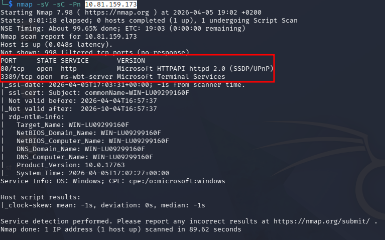
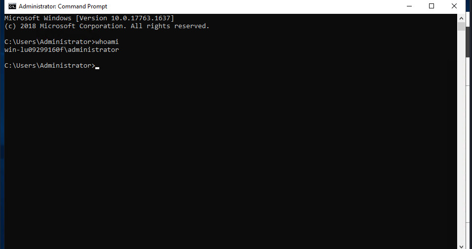

---
layout: default
---

# Máquina ANTHEM

## 1. Fase de Reconocimiento

El primer paso es identificar los servicios activos en la dirección IP de la víctima mediante un escaneo de puertos con `nmap`.

### Escaneo de Puertos

**Comando ejecutado:**

```bash
nmap -sV -sC -Pn 10.81.159.173
```



## 2. Enumeración Web

Al acceder a la IP a través del navegador (`http://10.81.159.173`), observamos un blog basado en el CMS **Umbraco**. El sitio se presenta como "Anthem.com".


## 3. Enumeración de Directorios (Fuerza Bruta)

Para descubrir rutas ocultas en el servidor web, se utilizó **Gobuster** con un diccionario de términos comunes.

### Ejecución de Gobuster

**Comando:**

```bash
gobuster dir -u http://10.81.159.173 -w /usr/share/wordlists/dirb/common.txt
```


## 4. Análisis de `robots.txt`

Al acceder al archivo `http://10.81.159.173/robots.txt`, se descubrió información crítica que el administrador dejó expuesta.

### Contenido del archivo


## 5. OSINT e Identificación de Usuario

Tras analizar los posts del blog, se encontró un artículo titulado *"A cheers to our IT department"* que contiene un poema.

### Hallazgo de OSINT

Al investigar el contenido del poema en Google, se identificó que pertenece a la rima infantil **Solomon Grundy**.


### Construcción de Credenciales

Utilizando el nombre del personaje y el dominio identificado anteriormente (`anthem.com`), podemos deducir el posible nombre de usuario basándonos en el formato estándar de la empresa (iniciales):


- **Nombre:** Solomon Grundy
- **Usuario (Probable):** `SG`
- **Contraseña (de robots.txt):** `UmbracoIsTheBest!`

## 6. Intrusión Inicial (Acceso RDP)

Con las credenciales obtenidas, procedemos a intentar un acceso remoto mediante el protocolo **RDP** (puerto 3389).

**Comando de conexión:**

```bash
xfreerdp /v:10.81.159.173 /u:SG /p:UmbracoIsTheBest! /dynamic-resolution +clipboard
```

## 7. Escalada de Privilegios: Enumeración Local

Una vez dentro del sistema como el usuario **SG**, el siguiente objetivo es encontrar credenciales o configuraciones mal protegidas para convertirnos en **Administrador**.

### Exploración de Archivos Ocultos

Dado que el entorno es Windows, se utilizó el Explorador de Archivos para inspeccionar la raíz del sistema.

1. Se navegó hasta: **This PC** > **Local Disk (C:)**.
2. Se habilitó la opción **"Hidden items"** en la pestaña **View** para revelar archivos y carpetas ocultos por el sistema.


## 8. Identificación del Vector de Escalada

Tras habilitar la visualización de elementos ocultos en `C:\`, se ha identificado una carpeta crítica que no estaba a la vista inicialmente.

### Extracción de Credenciales

Ahora debemos investigar el contenido de esa carpeta.

1. **Entra en `C:\backup`**: Si te deja entrar directamente, busca un archivo (posiblemente un archivo comprimido o un `.txt` con nombres como "restore").
2. **Si el acceso está denegado:** - Haz clic derecho sobre la carpeta `backup` -> **Properties**.
    - Ve a la pestaña **Security**.
    - Haz clic en **Edit** y luego en **Add**.
    - Escribe tu nombre de usuario (`SG`) y dale a **Check Names**.
    - Marca la casilla de **Full Control** o **Read**, acepta todo y vuelve a intentar entrar.


## 9. Escalada a Super Usuario (Administrator)

Tras obtener la contraseña `ChangeMeBaby1MoreTime` del archivo de restauración, se procedió a elevar privilegios directamente desde la sesión del usuario **SG**.

### Método: Elevación con "Run as Administrator"

Para evitar el cierre de la sesión actual, se utilizó la funcionalidad de elevación de Windows:

- Accedmos desde la cmd a administrador


- Una vez realizado introducimos la contraseña que hemos encontrado (ChangeMeBaby1MoreTime)


- Como podemos comprobar estamos dentro y ya somos admin


