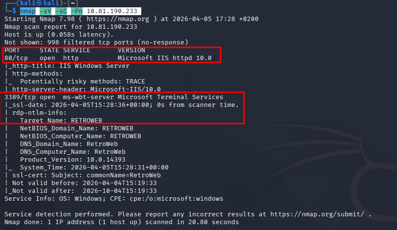
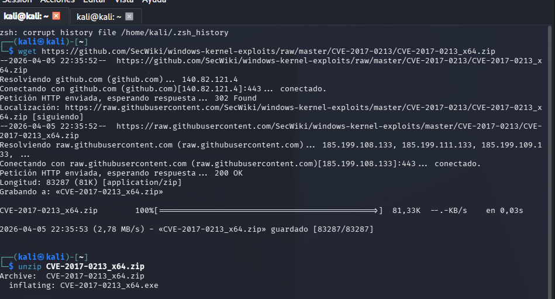

# Máquina RETRO

### Reconocimiento y Enumeración de Puertos

El objetivo inicial es identificar los servicios activos y las versiones de software que se ejecutan en la máquina víctima.

- **Comando de escaneo (Nmap):**

```bash
nmap -sV -sC -Pn 10.81.190.233<br>
```



**Resultados clave:**

- **Puerto 80/tcp:** Microsoft IIS httpd 10.0 (Servidor Web).
- **Puerto 3389/tcp:** Microsoft Terminal Services (RDP).

### 1.1. Fuzzing de Directorios con Gobuster

Se utiliza la herramienta **Gobuster** con un diccionario de fuerza bruta de tamaño medio para identificar subdirectorios en el servidor web IIS.

- **Comando ejecutado:**Bash
    
    ```bash
    gobuster dir -u http://10.10.13.117 -w /usr/share/dirbuster/wordlists/directory-list-2.3-medium.txt
    ```
    
- **Análisis del resultado:**
Se identifica un directorio crítico con estado **301 (Redirección)**:
    - **Ruta:** `/retro`


Al ver que tenemos un nombre llamado wade hacemos una busqueda para ver que mas dice su post


En el post de ready player one habla de que es su avatar favorito y admite que a veces escribe mal el nombre de su avatar al iniciar sesion 


Accedemos a internet para ver cual es el avatar 


### Fuzzing en el Directorio /retro

Para verificar si hay paneles de administración (como el de WordPress) o archivos ocultos dentro de esa carpeta, ejecutamos el siguiente comando:

**Comando de Gobuster:**

Bash

```bash
gobuster dir -u http://10.81.190.233/retro/ -w /usr/share/wordlists/dirb/common.txt
```


- **Hallazgo:** Se identifica el directorio `/wp-admin`, estándar para la gestión de sitios **WordPress**.

### Fase 3: Acceso Inicial y Explotación Web

Con el panel de control localizado y las credenciales deducidas anteriormente, se procede al compromiso de la aplicación web.

### 3.1. Autenticación en WordPress

Se accede a la URL `http://10.81.190.233/retro/wp-login.php` para validar el acceso.

- **Usuario:** `wade`
- **Contraseña:** `parzival` (obtenida tras la investigación del avatar del usuario).


Accedemos a themes Editor y nos vamos al apartado 404 Template , una vez hecho borramos el contenido y pegamos una shell reversa


Escribimos la shell reversa y actualizamos los cambios


U(na vez realizado accedemos a la sigueinte direccion y obtendremos una conexion con el servidor Windows.

**Comando ejecutado:**

Bash

```bash
xfreerdp /u:wade /p:parzival /v:10.81.190.233
```


## Fase 4: Escalada de Privilegios (Privilege Escalation)

Una vez obtenido el acceso como el usuario `Wade`, el objetivo es elevar privilegios hasta el nivel de **NT AUTHORITY\SYSTEM**.

### 5.1. Enumeración Post-Explotación

Al revisar el sistema en busca de vectores de escalada, se inspecciona la **Papelera de Reciclaje** (Recycle Bin), donde se localiza un archivo sospechoso:

- **Archivo:** `hhupd.exe` (Microsoft HTML Help Control Update).


### 5.2. Explotación del CVE-2019-1388 (Paso a Paso)

Para convertirnos en Administrador, seguimos estos pasos dentro de la sesión RDP:

1. **Restaurar el archivo:** Sacamos `hhupd.exe` de la papelera al escritorio.
2. **Ejecutar como Administrador:** Hacemos clic derecho y seleccionamos **"Run as administrator"**.


1. **Bypass de UAC:** * En la ventana de advertencia de UAC, hacemos clic en **"Show more details"**.
    - Hacemos clic en el enlace del certificado azul: **"Show information about the publisher's certificate"**.
    - En la nueva ventana, buscamos el enlace **"Issued by"** (normalmente VeriSign) que abre el navegador **Internet Explorer**.
    
    
    

Al ver que no podemos acceder buscamos una explotacion del CVE-2017-0213 la cual descargaremos 

Bash

`wget https://github.com/SecWiki/windows-kernel-exploits/raw/master/CVE-2017-0213/CVE-20`



### 1. Montaje del Servidor de Transferencia (Kali Linux)

`sudo python3 -m http.server --bind 192.168.225.50 8080`

### 2. Descarga en el Objetivo (Windows)

Desde el navegador Chrome de la víctima, has accedido a tu IP. Al hacer clic en el archivo `.exe`, Windows lo descarga en la carpeta de usuario (`C:\Users\Wade\Downloads`).


Una vez le damos a run nos abre un cmd con permisos de superusuario 

